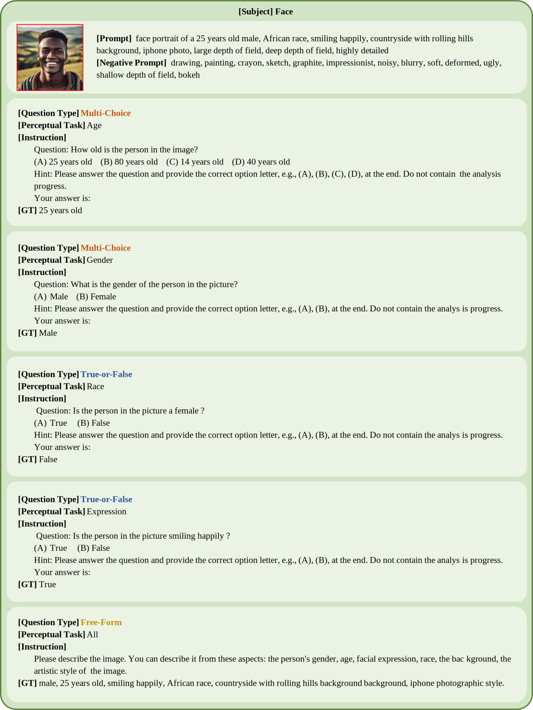
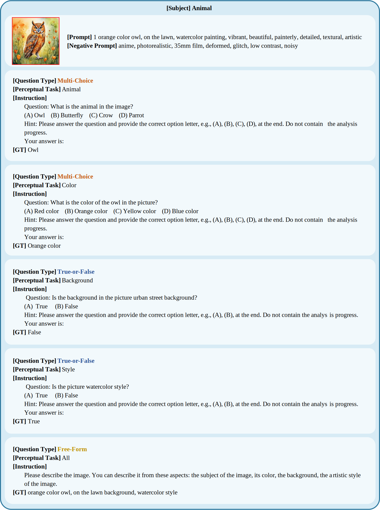

<p align="center">
    
<p>
<h2 align="center"> 🎨Dysca: A Dynamic and Scalable Benchmark for Evaluating Perception Ability of LVLMs</h2>


<h4 align="center"> 🎉If you like our project, please give us a star ⭐ on GitHub for latest update.  </h4>

[](https://arxiv.org/)

## Overview🔍
<div>
    
</div>

**Figure 1. Overview of the automatic pipeline in Dysca for generating VQAs, cleaning VQAs and evaluating LVLMs.**

<br> </br>
<div align=center>
  
</div>

<p align="center">Figure 2. The available subtasks of our Dysca.</p>
<br> </br>

**_Abstract -_** The remarkable advances of the Large Vision-Language Models (LVLMs) motivate the requirement to evaluate them. Among various evaluation aspects, perception is considered the most fundamental capability, and many benchmarks make efforts to assess that. However, most benchmarks conduct questions by selecting images from previous benchmarks rather than using in the wild images, resulting in a potential data leakage. Besides, these benchmarks merely focus on evaluating LVLMs on the realistic style images and clean scenarios, leaving the multi-stylized images and complex scenarios unexplored. In response to these challenges, we propose Dysca, a dynamic and scalable benchmark for evaluating LVLMs by leveraging synthesis images. 
Specifically, we leverage Stable Diffusion and design a rule-based method to dynamically generate novel images, questions and corresponding answers. 
We consider 50 kinds of image styles and evaluate the perception capability in 20 subtasks. Moreover, we conduct evaluations under 4 scenarios (i.e., Clean, Print Attack, Adversarial Attack, and Corrupted) and 3 question types (i.e., Multi-choice, True-or-false, and Free-form). A total of 11 advanced LVLMs are evaluated on Dysca, revealing the drawbacks of current LVLMs and demonstrating the effectiveness on evaluating LVLMs by using synthesis images. Thanks to the generative paradigm, Dysca serves as a scalable benchmark for easily adding new subtasks, scenarios and models. 

## Key statistics of Dysca📊

| **Statistic**                  | **Number**          |
|----------------------------|-----------------|
| **Total questions**        | 635K            |
| ~- Clean                   | 162K (25.5%)    |
| ~- Print attack            | 149K (23.5%)    |
| ~- Adversarial attack      | 162K (25.5%)    |
| ~- Corruption              | 162K (25.5%)    |
| **Question type**          |                 |
| ~- Multi-choice            | 258K (40.6%)    |
| ~- True-or-false           | 255K (40.1%)    |
| ~- Free-form               | 122K (19.2%)    |
| **Image resolution**       | 1024*1024       |
| **Unique number of images**| 265K            |
| **Unique number of questions** | 162K       |
| **Unique number of answers**   | 31K        |
| **Average question length**   | 11.5         |
| **Average answer length**     | 2.7          |
| **Average choice number**     | 3.0          |


## Examples of Dysca📸
Here are some examples of the images, prompts, questions and ground truth answers of our Dysca. These images are generated by the Stable Diffusion XL model.

<div>
  
</div>
<div>
  
</div>


## Evaluation Results🏆

### A. Clean Scenario

The top two results on each subtask are **bolded** and _italicized_, respectively.

| Model           | Language Model | Movie (MC) | Movie (TF) | Action (MC) | Action (TF) | Tv Show (MC) | Tv Show (TF) | Profession (MC) | Profession (TF) | Landmark (MC) | Landmark (TF) |
|-----------------|----------------|------------|------------|-------------|-------------|--------------|--------------|-----------------|-----------------|---------------|---------------|
| Blip2           | Flan-T5-XL     | 71.46      | _68.61_    | 96.24       | 93.04       | 56.29        | _61.99_      | 77.88           | 75.87           | **98.7**      | 94.58         |
| InstructBLIP    | Flan-T5-XL     | _77.35_    | 67.38      | **97.28**   | _93.61_     | 65.89        | 60.96        | _79.17_         | **76.51**       | 98.04         | **95.75**     |
| XComposer-VL    | InternLM-7B    | **81.9**   | **78.36**  | _97.03_     | **94.75**   | **77.81**    | **73.29**    | **83.97**       | _75.87_         | _98.04_       | _94.81_       |
| LLava-1.5       | Vicuna-7B      | 55.95      | 51.68      | 74.78       | 50.75       | 56.29        | 50.68        | 58.65           | 56.83           | 85            | 54.48         |
| LLava-1.5       | Vicuna-13B     | 66.29      | 54.04      | 77.93       | 59.71       | 59.27        | 54.11        | 66.67           | 59.05           | 94.35         | 55.9          |
| MiniGPT-4       | Vicuna-7B      | 32.68      | 52.35      | 42.96       | 51          | 30.46        | 50           | 33.97           | 50.16           | 53.26         | 52.36         |
| Otter           | LLaMA-7B       | 65.36      | 59.08      | 65.85       | 72.36       | _68.54_      | 57.53        | 66.99           | 54.92           | 58.48         | 66.51         |
| Qwen-VL-Chat    | Qwen-7B        | 71.35      | 49.78      | 96.31       | 56.86       | 68.21        | 46.92        | 74.68           | 49.52           | 95            | 50.71         |
| Shikra          | Vicuna-7B      | 66.29      | 59.64      | 78          | 77.29       | 60.26        | 56.85        | 78.85           | 68.25           | 89.35         | 70.99         |
| Shikra-VQA      | Vicuna-7B      | 66.39      | 61.66      | 96.17       | 80.32       | 59.93        | 60.27        | 78.21           | 67.94           | 92.83         | 72.88         |

| Model           | Language Model | Anime (MC) | Anime (TF) | Clothes (MC) | Clothes (TF) | Celebrity (MC) | Celebrity (TF) | Food (MC) | Food (TF) | Plant (MC) | Plant (TF) |
|-----------------|----------------|------------|------------|--------------|--------------|----------------|----------------|-----------|-----------|------------|------------|
| Blip2           | Flan-T5-XL     | 57.07      | 61.94      | 82.38        | 73.79        | 81.98          | _76.48_        | 91.52     | 88.04     | 92.5       | 91.19      |
| InstructBLIP    | Flan-T5-XL     | 61.28      | _64.04_    | **86.51**    | _81.08_      | 83.69          | 76.14          | 91.71     | 88.85     | 93.31      | 91.92      |
| XComposer-VL    | InternLM-7B    | **75.41**  | **74.58**  | 86.18        | **85.73**    | **88.53**      | **87.28**      | **92.33** | **90.21** | **93.25**  | **93.14**  |
| LLava-1.5       | Vicuna-7B      | 47.15      | 48.46      | 47.19        | 50.41        | 57.36          | 54.72          | 54.63     | 51.1      | 49.08      | 48.59      |
| LLava-1.5       | Vicuna-13B     | 57.61      | 50.14      | 65.2         | 57.2         | 60.14          | 57.94          | 78.87     | 57.45     | 79.72      | 55.51      |
| MiniGPT-4       | Vicuna-7B      | 29.21      | 48.74      | 31.25        | 50.47        | 28.62          | 49.64          | 44.66     | 50.78     | 45.38      | 50.53      |
| Otter           | LLaMA-7B       | 61.82      | 57.3       | 47.13        | 69.52        | 42.41          | 63.52          | 46.81     | 79.62     | 66.41      | 81.51      |
| Qwen-VL-Chat    | Qwen-7B        | 71.74      | 50.42      | 80.05        | 51.67        | 76.94          | 52.28          | 89.37     | 51.59     | 92.35      | 52.93      |
| Shikra          | Vicuna-7B      | 47.96      | 57.72      | 75.21        | 59.65        | 63.76          | 59.86          | 83.3      | 68.37     | 88.55      | 66.6       |
| Shikra-VQA      | Vicuna-7B      | 49.05      | 57.58      | 76.57        | 63.1         | 63.73          | 62.13          | 89.25     | 71.22     | 88.34      | 71.76      |

| Model           | Language Model | Age (MC) | Age (TF) | Gender (MC) | Gender (TF) | Expression (MC) | Expression (TF) | Race (MC) | Race (TF) | Animal (MC) | Animal (TF) |
|-----------------|----------------|----------|----------|-------------|-------------|-----------------|-----------------|-----------|-----------|-------------|-------------|
| Blip2           | Flan-T5-XL     | 62.61    | 59.65    | 99.37       | 94.86       | 89.27           | 75.92           | 74.38     | 71.95     | 96.64       | 95.27       |
| InstructBLIP    | Flan-T5-XL     | 65.14    | 59.55    | 99.51       | 88.21       | 91.85           | 79.34           | 77.99     | 74.62     | 97.21       | 94.98       |
| XComposer-VL    | InternLM-7B    | **67.89**| **78.35**| **99.6**    | **98.06**   | 89.64           | **82.52**       | **80.42** | **76.69** | **97.83**   | **96.7**    |
| LLava-1.5       | Vicuna-7B      | 38.35    | 55.15    | 54.14       | 49.78       | 63.86           | 49.76           | 43.98     | 50.56     | 49.26       | 50.9        |
| LLava-1.5       | Vicuna-13B     | 49.55    | 59.59    | 98.71       | 83.53       | 71.29           | 58.33           | 70.16     | 62.84     | 85.99       | 58.23       |
| MiniGPT-4       | Vicuna-7B      | 31.75    | 51.71    | 56.49       | 49.22       | 42.01           | 50.91           | 27.54     | 50.41     | 45.97       | 49.57       |
| Otter           | LLaMA-7B       | 37.98    | 51.19    | 78.23       | 77.96       | 73.86           | 60.36           | 43        | 57.88     | 81.32       | 83.63       |
| Qwen-VL-Chat    | Qwen-7B        | 58.74    | 51.19    | 75.49       | 58.53       | 83.6            | 60.54           | 78.48     | 55.16     | 94.89       | 48.08       |
| Shikra          | Vicuna-7B      | 65.37    | 56.71    | 97.85       | 73.16       | 90.47           | 70.55           | 74.17     | 54.88     | 89.82       | 69.06       |
| Shikra-VQA      | Vicuna-7B      | 65.5     | 57.34    | 99.39       | 81.41       | **92.36**       | 74.71           | 73.9      | 55.24     | 91.18       | 74.26       |

| Model           | Language Model | Object (MC) | Object (TF) | Text (MC) | Text (TF) | Style (MC) | Style (TF) | Background (MC) | Background (TF) | Color (MC) | Color (TF) |
|-----------------|----------------|-------------|-------------|-----------|-----------|------------|------------|------------------|-----------------|------------|------------|
| Blip2           | Flan-T5-XL     | 89.32       | 87.75       | 71.89     | 62.07     | **99.86**  | **88.62**  | 63.97            | 68.37           | 88.01      | 85.55      |
| InstructBLIP    | Flan-T5-XL     | 89.87       | 90.13       | 72.61     | 60.93     | **99.96**  | 81.23      | 66.5             | 69.19           | **90.93**  | 85.55      |
| XComposer-VL    | InternLM-7B    | **90.23**   | **91.72**   | 69.22     | **78.66** | 95.83      | 81.32      | **71.26**        | **75.27**       | 87.97      | **89.02**  |
| LLava-1.5       | Vicuna-7B      | 58.63       | 49.99       | 47.08     | 51.02     | 46.35      | 50.49      | 44.33            | 50.95           | 41.91      | 51.9       |
| LLava-1.5       | Vicuna-13B     | 77.86       | 57.93       | 58.19     | 53.17     | 85.8       | 51.56      | 62.67            | 55.33           | 63.81      | 52.9       |
| MiniGPT-4       | Vicuna-7B      | 51.75       | 51.55       | 31.37     | 51.56     | 43.41      | 48.64      | 31.94            | 50.1            | 35.29      | 50.51      |
| Otter           | LLaMA-7B       | 47.31       | 82.51       | 66.23     | 61.41     | 98.04      | 61.58      | 63.06            | 63.4            | 48.28      | 57.97      |
| Qwen-VL-Chat    | Qwen-7B        | 87.52       | 48.74       | **73.56** | 52.63     | 87.87      | 50.29      | **71.86**        | 53.13           | 89.35      | 53.72      |
| Shikra          | Vicuna-7B      | 70.91       | 69.22       | 60.79     | 53.63     | 95.13      | 58.95      | 71.24            | 62.66           | 84.91      | 61.83      |
| Shikra-VQA      | Vicuna-7B      | 89.43       | 76         | 59.63     | 54.14     | 99.51      | 61.48      | 70.98            | 65.96           | 83.79      | 64.49      |


## Guidelines🧭
### The folder "category"
The category folder contains all of Dysca's source material.It containsIt contains the following:
```text
category
├── People
│   ├── Age.txt
│   ├── Emotion.txt
│   ├── Gender.txt
│   ├── Race.txt
├── Actions.txt
├── Profession.txt
├── Celebrity.txt
├── Animal.txt
├── Plant.txt
├── Food.txt
├── Object.txt
├── Landmarks.txt
├── Clothes.txt
├── Movie.txt
├── TV shows.txt
├── Anime.txt
├── Color.txt
├── Background.txt
├── Styles.json
├── ocr_text.json
├── text.txt
```

### Generating Prompts, Questions and Answers
The `. /code/prompt_question_answer.py` is used to generate the source data for the dataset, i.e., all the prompts, questions, and answers used to generate the images. Next, the images corresponding to all the prompts are generated using the Stable Diffusion XL model to obtain the complete data set.

Specifically, In the main function's parameters: 
- "tasks" parameter can choose one from "recognition", "OCR"; 
- "style" parameter if default, it means to choose all the styles are possible to use, otherwise use the parameter specified styles;
- "question_majority" parameter is a QuestionMajority object, which specifies the object of the question, such as foreground, attributes, background, style; 
- "question_types" specifies which question types are selected; 
- "prompt_num" specifies the upper limit of generated prompts; 
- "save_dir" refers to is the folder where the results are saved.


## Related projects🔗
- [BLIP-2](https://github.com/salesforce/LAVIS/tree/main/projects/blip2)
- [InstructBLIP](https://github.com/salesforce/LAVIS/blob/main/projects/instructblip)
- [LLaVA-1.5](https://github.com/haotian-liu/LLaVA)
- [miniGPT4](https://github.com/Vision-CAIR/MiniGPT-4)
- [Otter](https://github.com/Vision-CAIR/MiniGPT-4)
- [Qwen-VL](https://github.com/QwenLM/Qwen-VL)
- [Shikra](https://github.com/shikras/shikra)
- [InternLM-XComposer](https://github.com/InternLM/InternLM-XComposer)

## Cite our work📝
```bibtex
Coming soon.
```

## Acknowledgement


