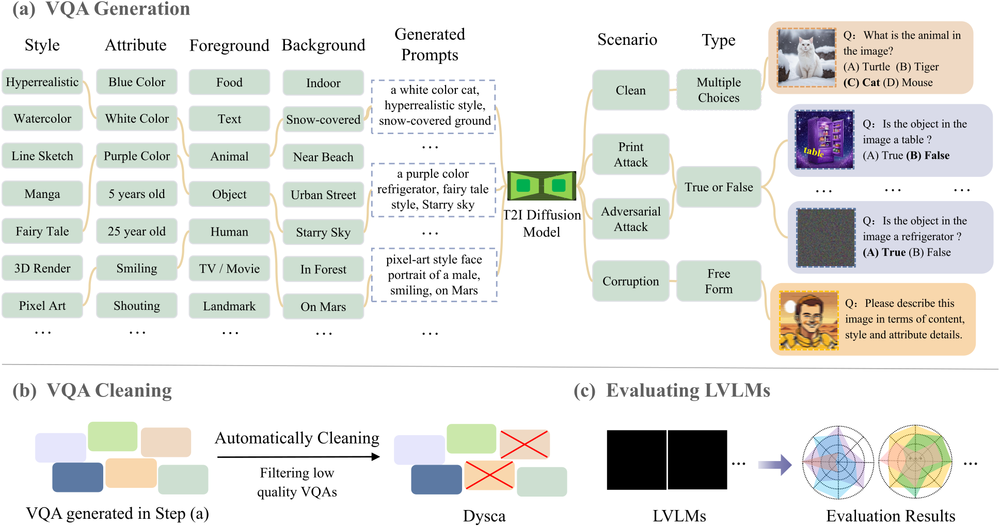

    

<h2 align="center"> 🎨Dysca: A Dynamic and Scalable Benchmark for Evaluating Perception Ability of LVLMs</h2>

<h4 align="center"> 🎉If you like our project, please give us a star ⭐ on GitHub for latest update.  </h4>

## Overview🔍

    

Figure 1. Overview of the automatic pipeline in Dysca for generating VQAs, cleaning VQAs and evaluating LVLMs.

   

  

Figure 2. The available subtasks of our Dysca.

   

**_Abstract -_** Currently many benchmarks have been proposed to evaluate the perception ability of the Large Vision-Language Models (LVLMs). However, most benchmarks conduct questions by selecting images from existing datasets, resulting in the potential data leakage. Besides, these benchmarks merely focus on evaluating LVLMs on the realistic style images and clean scenarios, leaving the multi-stylized images and noisy scenarios unexplored. In response to these challenges, we propose a dynamic and scalable benchmark named Dysca for evaluating LVLMs by leveraging synthesis images. Specifically, we leverage Stable Diffusion and design a rule-based method to dynamically generate novel images, questions and the corresponding answers. We consider 51 kinds of image styles and evaluate the perception capability in 20 subtasks. Moreover, we conduct evaluations under 4 scenarios (i.e., Clean, Corruption, Print Attacking and Adversarial Attacking) and 3 question types (i.e., Multi-choices, True-or-false and Free-form). Thanks to the generative paradigm, Dysca serves as a scalable benchmark for easily adding new subtasks and scenarios.A total of 8 advanced open-source LVLMs with 10 checkpoints are evaluated on Dysca, revealing the drawbacks of current LVLMs.

## Comparison with Existing Benchmarks📊

<table border="1" style="width:100%; border-collapse:collapse; text-align:center;">
  <caption>Comparisons between existing LVLM benchmarks. '⍻' indicates that the benchmarks include both newly collected images / annotations and images / annotations gathered from existing datasets. '*' The scale of our released benchmark is 617K, however Dysca is able to generate unlimited data to be tested.</caption>
  <thead>
    <tr>
      <th>Benchmark</th>
      <th>#Evaluation Data Scale</th>
      <th>#Perceptual Tasks</th>
      <th>Automatic Annotation</th>
      <th>Collecting from Existing Datasets</th>
      <th>Question Type</th>
      <th>Automatic Evaluation</th>
    </tr>
  </thead>
  <tbody>
    <tr>
      <td>LLaVA-Bench</td>
      <td>0.15K</td>
      <td>-</td>
      <td>×</td>
      <td>⍻</td>
      <td>Free-form</td>
      <td>√</td>
    </tr>
    <tr>
      <td>MME </td>
      <td>2.3K</td>
      <td>10</td>
      <td>×</td>
      <td>⍻</td>
      <td>True-or-false</td>
      <td>√</td>
    </tr>
    <tr>
      <td>LVLM-eHub</td>
      <td>-</td>
      <td>3</td>
      <td>√</td>
      <td>×</td>
      <td>Free-form</td>
      <td>×</td>
    </tr>
    <tr>
      <td>tiny-LVLM-eHub</td>
      <td>2.1K</td>
      <td>3</td>
      <td>√</td>
      <td>×</td>
      <td>Free-form</td>
      <td>√</td>
    </tr>
    <tr>
      <td>SEED-Bench</td>
      <td>19K</td>
      <td>8</td>
      <td>⍻</td>
      <td>×</td>
      <td>Multi-choices</td>
      <td>√</td>
    </tr>
    <tr>
      <td>MMBench </td>
      <td>2.9K</td>
      <td>12</td>
      <td>×</td>
      <td>⍻</td>
      <td>Multi-choices</td>
      <td>√</td>
    </tr>
    <tr>
      <td>TouchStone</td>
      <td>0.9K</td>
      <td>10</td>
      <td>×</td>
      <td>√</td>
      <td>Free-form</td>
      <td>√</td>
    </tr>
    <tr>
      <td>REFORM-EVAL</td>
      <td>50K</td>
      <td>7</td>
      <td>√</td>
      <td>×</td>
      <td>Multi-choices</td>
      <td>√</td>
    </tr>
    <tr>
      <td>MM-BigBench</td>
      <td>30K</td>
      <td>6</td>
      <td>√</td>
      <td>×</td>
      <td>Multi-choices</td>
      <td>√</td>
    </tr>
    <tr>
      <td>MM-VET</td>
      <td>0.2K</td>
      <td>4</td>
      <td>⍻</td>
      <td>⍻</td>
      <td>Free-form</td>
      <td>√</td>
    </tr>
    <tr>
      <td>MLLM-Bench</td>
      <td>0.42K</td>
      <td>7</td>
      <td>×</td>
      <td>⍻</td>
      <td>Free-form</td>
      <td>√</td>
    </tr>
    <tr>
      <td>SEED-Bench2</td>
      <td>24K</td>
      <td>10</td>
      <td>⍻</td>
      <td>×</td>
      <td>Multi-choices</td>
      <td>√</td>
    </tr>
    <tr>
      <td>BenchLMM</td>
      <td>2.4K</td>
      <td>15</td>
      <td>×</td>
      <td>×</td>
      <td>Free-form</td>
      <td>√</td>
    </tr>
    <tr>
      <td>JourneyDB</td>
      <td>5.4K</td>
      <td>2</td>
      <td>√</td>
      <td>√</td>
      <td>Free-form, Multi-choices</td>
      <td>√</td>
    </tr>
    <tr>
      <td>Dysca (Ours)</td>
      <td>617K*</td>
      <td>20</td>
      <td>√</td>
      <td>√</td>
      <td>Free-form, Multi-choices, True-or-false</td>
      <td>√</td>
    </tr>
  </tbody>
</table>

## Examples of Dysca📸
Here are some examples of the images, prompts, questions and ground truth answers of our Dysca. These images are generated by diffusion models.

[//]: # (插入图片)

      

      

      

      

## Leaderboards🏆

### A. Comprehensive Performance Leaderboards under each scenario

<table style="width:100%">
  <tr>
    <td style="width:22%">
      <table border="1" style="width:100%">
        <thead>
          <tr>
            <th>Rank</th>
            <th>Model</th>
            <th>Score</th>
          </tr>
        </thead>
        <tbody>
          <tr><td>🥇</td><td>XComposer-VL</td><td>217.07</td></tr>
          <tr><td>🥈</td><td>InstructBlip</td><td>202.23</td></tr>
          <tr><td>🥉</td><td>Blip2</td><td>198.41</td></tr>
          <tr><td>4</td><td>Qwen-VL-Chat</td><td>188.05</td></tr>
          <tr><td>5</td><td>Shikra</td><td>187.57</td></tr>
          <tr><td>6</td><td>LLAVA-1.5-13B</td><td>177.83</td></tr>
          <tr><td>7</td><td>Shikra-VQA</td><td>175.93</td></tr>
          <tr><td>8</td><td>Otter</td><td>166.47</td></tr>
          <tr><td>9</td><td>LLAVA-1.5-7B</td><td>155.26</td></tr>
          <tr><td>10</td><td>MiniGPT-4</td><td>127.91</td></tr>
        </tbody>
      </table>
      
<em>Clean</em>

    </td>
    <td style="width:22%">
      <table border="1" style="width:100%">
        <thead>
          <tr>
            <th>Rank</th>
            <th>Model</th>
            <th>Score</th>
          </tr>
        </thead>
        <tbody>
          <tr><td>🥇</td><td>XComposer-VL</td><td>214.88</td></tr>
          <tr><td>🥈</td><td>InstructBlip</td><td>201.06</td></tr>
          <tr><td>🥉</td><td>Blip2</td><td>196.47</td></tr>
          <tr><td>4</td><td>Shikra</td><td>187.16</td></tr>
          <tr><td>5</td><td>Qwen-VL-Chat</td><td>181.74</td></tr>
          <tr><td>6</td><td>LLAVA-1.5-13B</td><td>176.19</td></tr>
          <tr><td>7</td><td>Shikra-VQA</td><td>175.41</td></tr>
          <tr><td>8</td><td>Otter</td><td>166.26</td></tr>
          <tr><td>9</td><td>LLAVA-1.5-7B</td><td>154.15</td></tr>
          <tr><td>10</td><td>MiniGPT-4</td><td>129.04</td></tr>
        </tbody>
      </table>
      
<em>Corruption</em>

    </td>
    <td style="width:22%">
      <table border="1" style="width:100%">
        <thead>
          <tr>
            <th>Rank</th>
            <th>Model</th>
            <th>Score</th>
          </tr>
        </thead>
        <tbody>
          <tr><td>🥇</td><td>XComposer-VL</td><td>191.25</td></tr>
          <tr><td>🥈</td><td>Blip2</td><td>168.61</td></tr>
          <tr><td>🥉</td><td>Qwen-VL-Chat</td><td>154.73</td></tr>
          <tr><td>4</td><td>InstructBlip</td><td>153.69</td></tr>
          <tr><td>5</td><td>Shikra</td><td>147.23</td></tr>
          <tr><td>6</td><td>LLAVA-1.5-13B</td><td>152.10</td></tr>
          <tr><td>7</td><td>LLAVA-1.5-7B</td><td>139.34</td></tr>
          <tr><td>8</td><td>Shikra-VQA</td><td>131.16</td></tr>
          <tr><td>9</td><td>MiniGPT-4</td><td>128.61</td></tr>
          <tr><td>10</td><td>Otter</td><td>111.31</td></tr>
        </tbody>
      </table>
      
<em>Print Attacking</em>

    </td>
    <td style="width:22%">
      <table border="1" style="width:100%">
        <thead>
          <tr>
            <th>Rank</th>
            <th>Model</th>
            <th>Score</th>
          </tr>
        </thead>
        <tbody>
          <tr><td>🥇</td><td>Qwen-VL-Chat</td><td>181.18</td></tr>
          <tr><td>🥈</td><td>Shikra</td><td>177.92</td></tr>
          <tr><td>🥉</td><td>LLAVA-1.5-13B</td><td>170.53</td></tr>
          <tr><td>4</td><td>Shikra-VQA</td><td>165.49</td></tr>
          <tr><td>5</td><td>Otter</td><td>155.81</td></tr>
          <tr><td>6</td><td>LLAVA-1.5-7B</td><td>150.23</td></tr>
          <tr><td>7</td><td>InstructBlip</td><td>99.38</td></tr>
          <tr><td>8</td><td>MiniGPT-4</td><td>98.86</td></tr>
          <tr><td>9</td><td>Blip2</td><td>97.96</td></tr>
          <tr><td>10</td><td>XComposer-VL</td><td>91.56</td></tr>
        </tbody>
      </table>
      
<em>Adversarial Attacking</em>

    </td>
  </tr>
</table>

### B. Fine-grained Leaderboards under each scenario

#### 1. Clean 

<table style="width:100%">
  <tr>
    <td style="width:22%">
      <table border="1" style="width:100%">
        <thead>
          <tr>
            <th>Rank</th>
            <th>Model</th>
            <th>Score</th>
          </tr>
        </thead>
        <tbody>
          <tr><td>1</td><td>XComposer-VL</td><td>80.13</td></tr>
          <tr><td>2</td><td>InstructBlip</td><td>72.36</td></tr>
          <tr><td>3</td><td>Blip2</td><td>70.03</td></tr>
          <tr><td>4</td><td>Shikra-VQA</td><td>64.03</td></tr>
          <tr><td>5</td><td>Shikra</td><td>62.97</td></tr>
          <tr><td>6</td><td>Otter</td><td>62.22</td></tr>
          <tr><td>7</td><td>Qwen-VL-Chat</td><td>61.13</td></tr>
          <tr><td>8</td><td>LLAVA-1.5-13B</td><td>60.17</td></tr>
          <tr><td>9</td><td>LLAVA-1.5-7B</td><td>53.81</td></tr>
          <tr><td>10</td><td>MiniGPT-4</td><td>42.52</td></tr>
        </tbody>
      </table>
      
<em>Clean-Movie</em>

    </td>
    <td style="width:22%">
      <table border="1" style="width:100%">
        <thead>
          <tr>
            <th>Rank</th>
            <th>Model</th>
            <th>Score</th>
          </tr>
        </thead>
        <tbody>
          <tr><td>1</td><td>XComposer-VL</td><td>95.89</td></tr>
          <tr><td>2</td><td>InstructBlip</td><td>95.44</td></tr>
          <tr><td>3</td><td>Blip2</td><td>94.64</td></tr>
          <tr><td>4</td><td>Shikra-VQA</td><td>88.25</td></tr>
          <tr><td>5</td><td>Qwen-VL-Chat</td><td>79.75</td></tr>
          <tr><td>6</td><td>Shikra</td><td>77.65</td></tr>
          <tr><td>7</td><td>Otter</td><td>69.10</td></tr>
          <tr><td>8</td><td>LLAVA-1.5-13B</td><td>68.82</td></tr>
          <tr><td>9</td><td>LLAVA-1.5-7B</td><td>62.77</td></tr>
          <tr><td>10</td><td>MiniGPT-4</td><td>46.98</td></tr>
        </tbody>
      </table>
      
<em>Clean-Action</em>

    </td>
    <td style="width:22%">
      <table border="1" style="width:100%">
        <thead>
          <tr>
            <th>Rank</th>
            <th>Model</th>
            <th>Score</th>
          </tr>
        </thead>
        <tbody>
          <tr><td>1</td><td>XComposer-VL</td><td>75.55</td></tr>
          <tr><td>2</td><td>InstructBlip</td><td>63.42</td></tr>
          <tr><td>3</td><td>Otter</td><td>63.04</td></tr>
          <tr><td>4</td><td>Shikra-VQA</td><td>60.10</td></tr>
          <tr><td>5</td><td>Blip2</td><td>59.14</td></tr>
          <tr><td>6</td><td>Shikra</td><td>58.55</td></tr>
          <tr><td>7</td><td>Qwen-VL-Chat</td><td>58.27</td></tr>
          <tr><td>8</td><td>LLAVA-1.5-13B</td><td>56.69</td></tr>
          <tr><td>9</td><td>LLAVA-1.5-7B</td><td>53.48</td></tr>
          <tr><td>10</td><td>MiniGPT-4</td><td>40.23</td></tr>
        </tbody>
      </table>
      
<em>Clean-TV Show</em>

    </td>
    <td style="width:22%">
      <table border="1" style="width:100%">
        <thead>
          <tr>
            <th>Rank</th>
            <th>Model</th>
            <th>Score</th>
          </tr>
        </thead>
        <tbody>
          <tr><td>1</td><td>XComposer-VL</td><td>79.92</td></tr>
          <tr><td>2</td><td>InstructBlip</td><td>77.84</td></tr>
          <tr><td>3</td><td>Blip2</td><td>76.88</td></tr>
          <tr><td>4</td><td>Shikra</td><td>73.55</td></tr>
          <tr><td>5</td><td>Shikra-VQA</td><td>73.07</td></tr>
          <tr><td>6</td><td>Qwen-VL-Chat</td><td>65.12</td></tr>
          <tr><td>7</td><td>LLAVA-1.5-13B</td><td>62.86</td></tr>
          <tr><td>8</td><td>Otter</td><td>60.95</td></tr>
          <tr><td>9</td><td>LLAVA-1.5-7B</td><td>57.74</td></tr>
          <tr><td>10</td><td>MiniGPT-4</td><td>42.06</td></tr>
        </tbody>
      </table>
      
<em>Clean-Profession</em>

    </td>
  </tr>
  <tr>
    <td style="width:22%">
      <table border="1" style="width:100%">
        <thead>
          <tr>
            <th>Rank</th>
            <th>Model</th>
            <th>Score</th>
          </tr>
        </thead>
        <tbody>
          <tr><td>1</td><td>InstructBlip</td><td>96.90</td></tr>
          <tr><td>2</td><td>Blip2</td><td>96.64</td></tr>
          <tr><td>3</td><td>XComposer-VL</td><td>96.43</td></tr>
          <tr><td>4</td><td>Shikra-VQA</td><td>82.85</td></tr>
          <tr><td>5</td><td>Shikra</td><td>80.17</td></tr>
          <tr><td>6</td><td>Qwen-VL-Chat</td><td>75.84</td></tr>
          <tr><td>7</td><td>LLAVA-1.5-13B</td><td>75.12</td></tr>
          <tr><td>8</td><td>LLAVA-1.5-7B</td><td>69.74</td></tr>
          <tr><td>9</td><td>Otter</td><td>62.50</td></tr>
          <tr><td>10</td><td>MiniGPT-4</td><td>52.81</td></tr>
        </tbody>
      </table>
      
<em>Clean-Landmark</em>

    </td>
    <td style="width:22%">
      <table border="1" style="width:100%">
        <thead>
          <tr>
            <th>Rank</th>
            <th>Model</th>
            <th>Score</th>
          </tr>
        </thead>
        <tbody>
          <tr><td>1</td><td>XComposer-VL</td><td>75.00</td></tr>
          <tr><td>2</td><td>Qwen-VL-Chat</td><td>63.11</td></tr>
          <tr><td>3</td><td>InstructBlip</td><td>62.66</td></tr>
          <tr><td>4</td><td>Otter</td><td>59.56</td></tr>
          <tr><td>5</td><td>Blip2</td><td>59.50</td></tr>
          <tr><td>6</td><td>LLAVA-1.5-13B</td><td>53.88</td></tr>
          <tr><td>7</td><td>Shikra-VQA</td><td>53.31</td></tr>
          <tr><td>8</td><td>Shikra</td><td>52.84</td></tr>
          <tr><td>9</td><td>LLAVA-1.5-7B</td><td>47.80</td></tr>
          <tr><td>10</td><td>MiniGPT-4</td><td>38.98</td></tr>
        </tbody>
      </table>
      
<em>Clean-Anime</em>

    </td>
    <td style="width:22%">
      <table border="1" style="width:100%">
        <thead>
          <tr>
            <th>Rank</th>
            <th>Model</th>
            <th>Score</th>
          </tr>
        </thead>
        <tbody>
          <tr><td>1</td><td>XComposer-VL</td><td>85.96</td></tr>
          <tr><td>2</td><td>InstructBlip</td><td>83.80</td></tr>
          <tr><td>3</td><td>Blip2</td><td>78.09</td></tr>
          <tr><td>4</td><td>Shikra-VQA</td><td>69.83</td></tr>
          <tr><td>5</td><td>Qwen-VL-Chat</td><td>69.58</td></tr>
          <tr><td>6</td><td>Shikra</td><td>67.43</td></tr>
          <tr><td>7</td><td>LLAVA-1.5-13B</td><td>61.20</td></tr>
          <tr><td>8</td><td>Otter</td><td>58.33</td></tr>
          <tr><td>9</td><td>LLAVA-1.5-7B</td><td>48.80</td></tr>
          <tr><td>10</td><td>MiniGPT-4</td><td>40.86</td></tr>
        </tbody>
      </table>
      
<em>Clean-Clothes</em>

    </td>
    <td style="width:22%">
      <table border="1" style="width:100%">
        <thead>
          <tr>
            <th>Rank</th>
            <th>Model</th>
            <th>Score</th>
          </tr>
        </thead>
        <tbody>
          <tr><td>1</td><td>XComposer-VL</td><td>87.91</td></tr>
          <tr><td>2</td><td>InstructBlip</td><td>79.91</td></tr>
          <tr><td>3</td><td>Blip2</td><td>79.23</td></tr>
          <tr><td>4</td><td>Qwen-VL-Chat</td><td>68.71</td></tr>
          <tr><td>5</td><td>Shikra-VQA</td><td>62.93</td></tr>
          <tr><td>6</td><td>Shikra</td><td>61.81</td></tr>
          <tr><td>7</td><td>LLAVA-1.5-13B</td><td>59.04</td></tr>
          <tr><td>8</td><td>LLAVA-1.5-7B</td><td>56.04</td></tr>
          <tr><td>9</td><td>Otter</td><td>52.97</td></tr>
          <tr><td>10</td><td>MiniGPT-4</td><td>39.13</td></tr>
        </tbody>
      </table>
      
<em>Clean-Celebrity</em>

    </td>
  </tr>
  <tr>
    <td style="width:22%">
      <table border="1" style="width:100%">
        <thead>
          <tr>
            <th>Rank</th>
            <th>Model</th>
            <th>Score</th>
          </tr>
        </thead>
        <tbody>
          <tr><td>1</td><td>XComposer-VL</td><td>91.27</td></tr>
          <tr><td>2</td><td>InstructBlip</td><td>90.28</td></tr>
          <tr><td>3</td><td>Blip2</td><td>89.78</td></tr>
          <tr><td>4</td><td>Shikra-VQA</td><td>80.23</td></tr>
          <tr><td>5</td><td>Shikra</td><td>75.84</td></tr>
          <tr><td>6</td><td>Qwen-VL-Chat</td><td>71.37</td></tr>
          <tr><td>7</td><td>LLAVA-1.5-13B</td><td>68.16</td></tr>
          <tr><td>8</td><td>Otter</td><td>63.22</td></tr>
          <tr><td>9</td><td>LLAVA-1.5-7B</td><td>52.87</td></tr>
          <tr><td>10</td><td>MiniGPT-4</td><td>47.72</td></tr>
        </tbody>
      </table>
      
<em>Clean-Food</em>

    </td>
    <td style="width:22%">
      <table border="1" style="width:100%">
        <thead>
          <tr>
            <th>Rank</th>
            <th>Model</th>
            <th>Score</th>
          </tr>
        </thead>
        <tbody>
          <tr><td>1</td><td>XComposer-VL</td><td>93.19</td></tr>
          <tr><td>2</td><td>InstructBlip</td><td>92.62</td></tr>
          <tr><td>3</td><td>Blip2</td><td>91.84</td></tr>
          <tr><td>4</td><td>Shikra-VQA</td><td>80.05</td></tr>
          <tr><td>5</td><td>Shikra</td><td>77.57</td></tr>
          <tr><td>6</td><td>Qwen-VL-Chat</td><td>76.11</td></tr>
          <tr><td>7</td><td>Otter</td><td>73.96</td></tr>
          <tr><td>8</td><td>LLAVA-1.5-13B</td><td>67.61</td></tr>
          <tr><td>9</td><td>LLAVA-1.5-7B</td><td>48.84</td></tr>
          <tr><td>10</td><td>MiniGPT-4</td><td>47.95</td></tr>
        </tbody>
      </table>
      
<em>Clean-Plant</em>

    </td>
    <td style="width:22%">
      <table border="1" style="width:100%">
        <thead>
          <tr>
            <th>Rank</th>
            <th>Model</th>
            <th>Score</th>
          </tr>
        </thead>
        <tbody>
          <tr><td>1</td><td>XComposer-VL</td><td>73.12</td></tr>
          <tr><td>2</td><td>InstructBlip</td><td>62.34</td></tr>
          <tr><td>3</td><td>Shikra-VQA</td><td>61.42</td></tr>
          <tr><td>4</td><td>Blip2</td><td>61.13</td></tr>
          <tr><td>5</td><td>Shikra</td><td>61.04</td></tr>
          <tr><td>6</td><td>LLAVA-1.5-13B</td><td>54.57</td></tr>
          <tr><td>7</td><td>Qwen-VL-Chat</td><td>51.28</td></tr>
          <tr><td>8</td><td>LLAVA-1.5-7B</td><td>46.75</td></tr>
          <tr><td>9</td><td>Otter</td><td>44.58</td></tr>
          <tr><td>10</td><td>MiniGPT-4</td><td>41.73</td></tr>
        </tbody>
      </table>
      
<em>Clean-Age</em>

    </td>
    <td style="width:22%">
      <table border="1" style="width:100%">
        <thead>
          <tr>
            <th>Rank</th>
            <th>Model</th>
            <th>Score</th>
          </tr>
        </thead>
        <tbody>
          <tr><td>1</td><td>XComposer-VL</td><td>98.83</td></tr>
          <tr><td>2</td><td>Blip2</td><td>97.12</td></tr>
          <tr><td>3</td><td>InstructBlip</td><td>93.86</td></tr>
          <tr><td>4</td><td>LLAVA-1.5-13B</td><td>91.12</td></tr>
          <tr><td>5</td><td>Shikra-VQA</td><td>90.40</td></tr>
          <tr><td>6</td><td>Shikra</td><td>85.50</td></tr>
          <tr><td>7</td><td>Qwen-VL-Chat</td><td>78.13</td></tr>
          <tr><td>8</td><td>Otter</td><td>78.09</td></tr>
          <tr><td>9</td><td>MiniGPT-4</td><td>52.86</td></tr>
          <tr><td>10</td><td>LLAVA-1.5-7B</td><td>51.96</td></tr>
        </tbody>
      </table>
      
<em>Clean-Gender</em>

    </td>
  </tr>
  <tr>
    <td style="width:22%">
      <table border="1" style="width:100%">
        <thead>
          <tr>
            <th>Rank</th>
            <th>Model</th>
            <th>Score</th>
          </tr>
        </thead>
        <tbody>
          <tr><td>1</td><td>XComposer-VL</td><td>86.08</td></tr>
          <tr><td>2</td><td>InstructBlip</td><td>85.59</td></tr>
          <tr><td>3</td><td>Shikra-VQA</td><td>83.53</td></tr>
          <tr><td>4</td><td>Blip2</td><td>82.59</td></tr>
          <tr><td>5</td><td>Shikra</td><td>80.51</td></tr>
          <tr><td>6</td><td>Qwen-VL-Chat</td><td>74.76</td></tr>
          <tr><td>7</td><td>Otter</td><td>67.11</td></tr>
          <tr><td>8</td><td>LLAVA-1.5-13B</td><td>64.81</td></tr>
          <tr><td>9</td><td>LLAVA-1.5-7B</td><td>56.81</td></tr>
          <tr><td>10</td><td>MiniGPT-4</td><td>46.46</td></tr>
        </tbody>
      </table>
      
<em>Clean-Expression</em>

    </td>
    <td style="width:22%">
      <table border="1" style="width:100%">
        <thead>
          <tr>
            <th>Rank</th>
            <th>Model</th>
            <th>Score</th>
          </tr>
        </thead>
        <tbody>
          <tr><td>1</td><td>XComposer-VL</td><td>78.56</td></tr>
          <tr><td>2</td><td>InstructBlip</td><td>76.31</td></tr>
          <tr><td>3</td><td>Blip2</td><td>73.16</td></tr>
          <tr><td>4</td><td>LLAVA-1.5-13B</td><td>66.50</td></tr>
          <tr><td>5</td><td>Qwen-VL-Chat</td><td>65.19</td></tr>
          <tr><td>6</td><td>Shikra-VQA</td><td>64.56</td></tr>
          <tr><td>7</td><td>Shikra</td><td>64.53</td></tr>
          <tr><td>8</td><td>Otter</td><td>50.44</td></tr>
          <tr><td>9</td><td>LLAVA-1.5-7B</td><td>47.27</td></tr>
          <tr><td>10</td><td>MiniGPT-4</td><td>38.98</td></tr>
        </tbody>
      </table>
      
<em>Clean-Race</em>

    </td>
    <td style="width:22%">
      <table border="1" style="width:100%">
        <thead>
          <tr>
            <th>Rank</th>
            <th>Model</th>
            <th>Score</th>
          </tr>
        </thead>
        <tbody>
          <tr><td>1</td><td>XComposer-VL</td><td>97.27</td></tr>
          <tr><td>2</td><td>InstructBlip</td><td>96.09</td></tr>
          <tr><td>3</td><td>Blip2</td><td>95.95</td></tr>
          <tr><td>4</td><td>Shikra-VQA</td><td>82.72</td></tr>
          <tr><td>5</td><td>Otter</td><td>82.47</td></tr>
          <tr><td>6</td><td>Qwen-VL-Chat</td><td>79.98</td></tr>
          <tr><td>7</td><td>Shikra</td><td>79.44</td></tr>
          <tr><td>8</td><td>LLAVA-1.5-13B</td><td>72.11</td></tr>
          <tr><td>9</td><td>LLAVA-1.5-7B</td><td>50.08</td></tr>
          <tr><td>10</td><td>MiniGPT-4</td><td>47.77</td></tr>
        </tbody>
      </table>
      
<em>Clean-Animal</em>

    </td>
    <td style="width:22%">
      <table border="1" style="width:100%">
        <thead>
          <tr>
            <th>Rank</th>
            <th>Model</th>
            <th>Score</th>
          </tr>
        </thead>
        <tbody>
          <tr><td>1</td><td>XComposer-VL</td><td>90.97</td></tr>
          <tr><td>2</td><td>InstructBlip</td><td>90.00</td></tr>
          <tr><td>3</td><td>Blip2</td><td>88.53</td></tr>
          <tr><td>4</td><td>Shikra-VQA</td><td>82.72</td></tr>
          <tr><td>5</td><td>Qwen-VL-Chat</td><td>75.73</td></tr>
          <tr><td>6</td><td>Shikra</td><td>70.06</td></tr>
          <tr><td>7</td><td>LLAVA-1.5-13B</td><td>67.89</td></tr>
          <tr><td>8</td><td>Otter</td><td>64.91</td></tr>
          <tr><td>9</td><td>LLAVA-1.5-7B</td><td>54.31</td></tr>
          <tr><td>10</td><td>MiniGPT-4</td><td>51.65</td></tr>
        </tbody>
      </table>
      
<em>Clean-Object</em>

    </td>
  </tr>
  <tr>
    <td style="width:22%">
      <table border="1" style="width:100%">
        <thead>
          <tr>
            <th>Rank</th>
            <th>Model</th>
            <th>Score</th>
          </tr>
        </thead>
        <tbody>
          <tr><td>1</td><td>Blip2</td><td>68.38</td></tr>
          <tr><td>2</td><td>InstructBlip</td><td>67.50</td></tr>
          <tr><td>3</td><td>XComposer-VL</td><td>66.06</td></tr>
          <tr><td>4</td><td>Shikra-VQA</td><td>64.86</td></tr>
          <tr><td>5</td><td>Otter</td><td>64.37</td></tr>
          <tr><td>6</td><td>Qwen-VL-Chat</td><td>63.28</td></tr>
          <tr><td>7</td><td>Shikra</td><td>63.02</td></tr>
          <tr><td>8</td><td>LLAVA-1.5-13B</td><td>58.84</td></tr>
          <tr><td>9</td><td>LLAVA-1.5-7B</td><td>44.96</td></tr>
          <tr><td>10</td><td>MiniGPT-4</td><td>43.70</td></tr>
        </tbody>
      </table>
      
<em>Clean-OCR</em>

    </td>
    <td style="width:22%">
      <table border="1" style="width:100%">
        <thead>
          <tr>
            <th>Rank</th>
            <th>Model</th>
            <th>Score</th>
          </tr>
        </thead>
        <tbody>
          <tr><td>1</td><td>XComposer-VL</td><td>73.94</td></tr>
          <tr><td>2</td><td>Blip2</td><td>66.98</td></tr>
          <tr><td>3</td><td>InstructBlip</td><td>66.77</td></tr>
          <tr><td>4</td><td>Otter</td><td>63.82</td></tr>
          <tr><td>5</td><td>Qwen-VL-Chat</td><td>61.80</td></tr>
          <tr><td>6</td><td>Shikra</td><td>57.21</td></tr>
          <tr><td>7</td><td>Shikra-VQA</td><td>56.89</td></tr>
          <tr><td>8</td><td>LLAVA-1.5-13B</td><td>55.68</td></tr>
          <tr><td>9</td><td>LLAVA-1.5-7B</td><td>49.05</td></tr>
          <tr><td>10</td><td>MiniGPT-4</td><td>41.47</td></tr>
        </tbody>
      </table>
      
<em>Clean-Style</em>

    </td>
    <td style="width:22%">
      <table border="1" style="width:100%">
        <thead>
          <tr>
            <th>Rank</th>
            <th>Model</th>
            <th>Score</th>
          </tr>
        </thead>
        <tbody>
          <tr><td>1</td><td>XComposer-VL</td><td>73.27</td></tr>
          <tr><td>2</td><td>Shikra-VQA</td><td>68.47</td></tr>
          <tr><td>3</td><td>InstructBlip</td><td>67.84</td></tr>
          <tr><td>4</td><td>Shikra</td><td>66.95</td></tr>
          <tr><td>5</td><td>Blip2</td><td>66.17</td></tr>
          <tr><td>6</td><td>Otter</td><td>63.23</td></tr>
          <tr><td>7</td><td>Qwen-VL-Chat</td><td>60.51</td></tr>
          <tr><td>8</td><td>LLAVA-1.5-13B</td><td>59.00</td></tr>
          <tr><td>9</td><td>LLAVA-1.5-7B</td><td>47.64</td></tr>
          <tr><td>10</td><td>MiniGPT-4</td><td>41.02</td></tr>
        </tbody>
      </table>
      
<em>Clean-Background</em>

    </td>
    <td style="width:22%">
      <table border="1" style="width:100%">
        <thead>
          <tr>
            <th>Rank</th>
            <th>Model</th>
            <th>Score</th>
          </tr>
        </thead>
        <tbody>
          <tr><td>1</td><td>XComposer-VL</td><td>88.50</td></tr>
          <tr><td>2</td><td>InstructBlip</td><td>88.24</td></tr>
          <tr><td>3</td><td>Blip2</td><td>86.78</td></tr>
          <tr><td>4</td><td>Shikra-VQA</td><td>74.14</td></tr>
          <tr><td>5</td><td>Shikra</td><td>73.37</td></tr>
          <tr><td>6</td><td>Qwen-VL-Chat</td><td>69.72</td></tr>
          <tr><td>7</td><td>LLAVA-1.5-13B</td><td>58.36</td></tr>
          <tr><td>8</td><td>Otter</td><td>53.12</td></tr>
          <tr><td>9</td><td>LLAVA-1.5-7B</td><td>46.91</td></tr>
          <tr><td>10</td><td>MiniGPT-4</td><td>42.90</td></tr>
        </tbody>
      </table>
      
<em>Clean-Color</em>

    </td>
  </tr>
</table>

#### 2. Corruption

<table style="width:100%">
  <tr>
    <td style="width:22%">
      <table border="1" style="width:100%">
        <thead>
          <tr>
            <th>Rank</th>
            <th>Model</th>
            <th>Score</th>
          </tr>
        </thead>
        <tbody>
          <tr><td>1</td><td>XComposer-VL</td><td>78.20</td></tr>
          <tr><td>2</td><td>InstructBlip</td><td>71.30</td></tr>
          <tr><td>3</td><td>Blip2</td><td>68.69</td></tr>
          <tr><td>4</td><td>Shikra-VQA</td><td>64.19</td></tr>
          <tr><td>5</td><td>Shikra</td><td>63.47</td></tr>
          <tr><td>6</td><td>Otter</td><td>61.39</td></tr>
          <tr><td>7</td><td>Qwen-VL</td><td>59.27</td></tr>
          <tr><td>8</td><td>LLAVA-1.5-13B</td><td>58.67</td></tr>
          <tr><td>9</td><td>LLAVA-1.5-7B</td><td>52.36</td></tr>
          <tr><td>10</td><td>MiniGPT-4</td><td>43.02</td></tr>
        </tbody>
      </table>
      
<em>Corru.-Movie</em>

    </td>
    <td style="width:22%">
      <table border="1" style="width:100%">
        <thead>
          <tr>
            <th>Rank</th>
            <th>Model</th>
            <th>Score</th>
          </tr>
        </thead>
        <tbody>
          <tr><td>1</td><td>XComposer-VL</td><td>95.86</td></tr>
          <tr><td>2</td><td>InstructBlip</td><td>95.09</td></tr>
          <tr><td>3</td><td>Blip2</td><td>93.87</td></tr>
          <tr><td>4</td><td>Shikra-VQA</td><td>88.72</td></tr>
          <tr><td>5</td><td>Shikra</td><td>77.77</td></tr>
          <tr><td>6</td><td>Qwen-VL</td><td>75.09</td></tr>
          <tr><td>7</td><td>Otter</td><td>70.09</td></tr>
          <tr><td>8</td><td>LLAVA-1.5-13B</td><td>68.34</td></tr>
          <tr><td>9</td><td>LLAVA-1.5-7B</td><td>63.00</td></tr>
          <tr><td>10</td><td>MiniGPT-4</td><td>47.22</td></tr>
        </tbody>
      </table>
      
<em>Corru.-Action</em>

    </td>
    <td style="width:22%">
      <table border="1" style="width:100%">
        <thead>
          <tr>
            <th>Rank</th>
            <th>Model</th>
            <th>Score</th>
          </tr>
        </thead>
        <tbody>
          <tr><td>1</td><td>XComposer-VL</td><td>72.86</td></tr>
          <tr><td>2</td><td>InstructBlip</td><td>62.42</td></tr>
          <tr><td>3</td><td>Otter</td><td>60.71</td></tr>
          <tr><td>4</td><td>Shikra</td><td>60.09</td></tr>
          <tr><td>5</td><td>Shikra-VQA</td><td>59.58</td></tr>
          <tr><td>6</td><td>Blip2</td><td>58.16</td></tr>
          <tr><td>7</td><td>Qwen-VL</td><td>57.95</td></tr>
          <tr><td>8</td><td>LLAVA-1.5-13B</td><td>55.18</td></tr>
          <tr><td>9</td><td>LLAVA-1.5-7B</td><td>52.34</td></tr>
          <tr><td>10</td><td>MiniGPT-4</td><td>38.70</td></tr>
        </tbody>
      </table>
      
<em>Corru.-TV Show</em>

    </td>
    <td style="width:22%">
      <table border="1" style="width:100%">
        <thead>
          <tr>
            <th>Rank</th>
            <th>Model</th>
            <th>Score</th>
          </tr>
        </thead>
        <tbody>
          <tr><td>1</td><td>XComposer-VL</td><td>78.48</td></tr>
          <tr><td>2</td><td>InstructBlip</td><td>77.84</td></tr>
          <tr><td>3</td><td>Blip2</td><td>75.77</td></tr>
          <tr><td>4</td><td>Shikra</td><td>73.72</td></tr>
          <tr><td>5</td><td>Shikra-VQA</td><td>73.38</td></tr>
          <tr><td>6</td><td>Qwen-VL</td><td>64.97</td></tr>
          <tr><td>7</td><td>Otter</td><td>62.71</td></tr>
          <tr><td>8</td><td>LLAVA-1.5-13B</td><td>62.23</td></tr>
          <tr><td>9</td><td>LLAVA-1.5-7B</td><td>56.95</td></tr>
          <tr><td>10</td><td>MiniGPT-4</td><td>43.22</td></tr>
        </tbody>
      </table>
      
<em>Corru.-Profession</em>

    </td>
  </tr>
  <tr>
    <td style="width:22%">
      <table border="1" style="width:100%">
        <thead>
          <tr>
            <th>Rank</th>
            <th>Model</th>
            <th>Score</th>
          </tr>
        </thead>
        <tbody>
          <tr><td>1</td><td>InstructBlip</td><td>96.33</td></tr>
          <tr><td>2</td><td>Blip2</td><td>96.28</td></tr>
          <tr><td>3</td><td>XComposer-VL</td><td>95.97</td></tr>
          <tr><td>4</td><td>Shikra-VQA</td><td>83.01</td></tr>
          <tr><td>5</td><td>Shikra</td><td>82.38</td></tr>
          <tr><td>6</td><td>LLAVA-1.5-13B</td><td>74.63</td></tr>
          <tr><td>7</td><td>Qwen-VL</td><td>73.55</td></tr>
          <tr><td>8</td><td>LLAVA-1.5-7B</td><td>68.78</td></tr>
          <tr><td>9</td><td>Otter</td><td>61.65</td></tr>
          <tr><td>10</td><td>MiniGPT-4</td><td>49.55</td></tr>
        </tbody>
      </table>
      
<em>Corru.-Landmark</em>

    </td>
    <td style="width:22%">
      <table border="1" style="width:100%">
        <thead>
          <tr>
            <th>Rank</th>
            <th>Model</th>
            <th>Score</th>
          </tr>
        </thead>
        <tbody>
          <tr><td>1</td><td>XComposer-VL</td><td>72.28</td></tr>
          <tr><td>2</td><td>InstructBlip</td><td>62.79</td></tr>
          <tr><td>3</td><td>Qwen-VL</td><td>60.44</td></tr>
          <tr><td>4</td><td>Blip2</td><td>58.67</td></tr>
          <tr><td>5</td><td>Otter</td><td>57.24</td></tr>
          <tr><td>6</td><td>LLAVA-1.5-13B</td><td>53.67</td></tr>
          <tr><td>7</td><td>Shikra-VQA</td><td>52.28</td></tr>
          <tr><td>8</td><td>Shikra</td><td>52.00</td></tr>
          <tr><td>9</td><td>LLAVA-1.5-7B</td><td>47.87</td></tr>
          <tr><td>10</td><td>MiniGPT-4</td><td>40.91</td></tr>
        </tbody>
      </table>
      
<em>Corru.-Anime</em>

    </td>
    <td style="width:22%">
      <table border="1" style="width:100%">
        <thead>
          <tr>
            <th>Rank</th>
            <th>Model</th>
            <th>Score</th>
          </tr>
        </thead>
        <tbody>
          <tr><td>1</td><td>XComposer-VL</td><td>84.87</td></tr>
          <tr><td>2</td><td>InstructBlip</td><td>82.84</td></tr>
          <tr><td>3</td><td>Blip2</td><td>76.69</td></tr>
          <tr><td>4</td><td>Shikra-VQA</td><td>70.59</td></tr>
          <tr><td>5</td><td>Shikra</td><td>67.05</td></tr>
          <tr><td>6</td><td>Qwen-VL</td><td>64.26</td></tr>
          <tr><td>7</td><td>LLAVA-1.5-13B</td><td>60.88</td></tr>
          <tr><td>8</td><td>Otter</td><td>59.87</td></tr>
          <tr><td>9</td><td>LLAVA-1.5-7B</td><td>48.12</td></tr>
          <tr><td>10</td><td>MiniGPT-4</td><td>41.38</td></tr>
        </tbody>
      </table>
      
<em>Corru.-Clothes</em>

    </td>
    <td style="width:22%">
      <table border="1" style="width:100%">
        <thead>
          <tr>
            <th>Rank</th>
            <th>Model</th>
            <th>Score</th>
          </tr>
        </thead>
        <tbody>
          <tr><td>1</td><td>XComposer-VL</td><td>87.25</td></tr>
          <tr><td>2</td><td>InstructBlip</td><td>79.23</td></tr>
          <tr><td>3</td><td>Blip2</td><td>78.36</td></tr>
          <tr><td>4</td><td>Qwen-VL</td><td>64.89</td></tr>
          <tr><td>5</td><td>Shikra-VQA</td><td>62.55</td></tr>
          <tr><td>6</td><td>Shikra</td><td>61.68</td></tr>
          <tr><td>7</td><td>LLAVA-1.5-13B</td><td>58.64</td></tr>
          <tr><td>8</td><td>LLAVA-1.5-7B</td><td>56.36</td></tr>
          <tr><td>9</td><td>Otter</td><td>53.59</td></tr>
          <tr><td>10</td><td>MiniGPT-4</td><td>38.80</td></tr>
        </tbody>
      </table>
      
<em>Corru.-Celebrity</em>

    </td>
  </tr>
  <tr>
    <td style="width:22%">
      <table border="1" style="width:100%">
        <thead>
          <tr>
            <th>Rank</th>
            <th>Model</th>
            <th>Score</th>
          </tr>
        </thead>
        <tbody>
          <tr><td>1</td><td>XComposer-VL</td><td>90.61</td></tr>
          <tr><td>2</td><td>InstructBlip</td><td>90.08</td></tr>
          <tr><td>3</td><td>Blip2</td><td>89.19</td></tr>
          <tr><td>4</td><td>Shikra-VQA</td><td>80.55</td></tr>
          <tr><td>5</td><td>Shikra</td><td>75.63</td></tr>
          <tr><td>6</td><td>Qwen-VL</td><td>70.71</td></tr>
          <tr><td>7</td><td>LLAVA-1.5-13B</td><td>67.46</td></tr>
          <tr><td>8</td><td>Otter</td><td>65.06</td></tr>
          <tr><td>9</td><td>LLAVA-1.5-7B</td><td>52.94</td></tr>
          <tr><td>10</td><td>MiniGPT-4</td><td>47.76</td></tr>
        </tbody>
      </table>
      
<em>Corru.-Food</em>

    </td>
    <td style="width:22%">
      <table border="1" style="width:100%">
        <thead>
          <tr>
            <th>Rank</th>
            <th>Model</th>
            <th>Score</th>
          </tr>
        </thead>
        <tbody>
          <tr><td>1</td><td>XComposer-VL</td><td>92.45</td></tr>
          <tr><td>2</td><td>InstructBlip</td><td>92.23</td></tr>
          <tr><td>3</td><td>Blip2</td><td>91.15</td></tr>
          <tr><td>4</td><td>Shikra-VQA</td><td>80.80</td></tr>
          <tr><td>5</td><td>Shikra</td><td>77.69</td></tr>
          <tr><td>6</td><td>Otter</td><td>73.42</td></tr>
          <tr><td>7</td><td>Qwen-VL</td><td>72.01</td></tr>
          <tr><td>8</td><td>LLAVA-1.5-13B</td><td>67.22</td></tr>
          <tr><td>9</td><td>LLAVA-1.5-7B</td><td>48.84</td></tr>
          <tr><td>10</td><td>MiniGPT-4</td><td>48.04</td></tr>
        </tbody>
      </table>
      
<em>Corru.-Plant</em>

    </td>
    <td style="width:22%">
      <table border="1" style="width:100%">
        <thead>
          <tr>
            <th>Rank</th>
            <th>Model</th>
            <th>Score</th>
          </tr>
        </thead>
        <tbody>
          <tr><td>1</td><td>XComposer-VL</td><td>73.04</td></tr>
          <tr><td>2</td><td>InstructBlip</td><td>61.59</td></tr>
          <tr><td>3</td><td>Shikra-VQA</td><td>61.09</td></tr>
          <tr><td>4</td><td>Shikra</td><td>60.40</td></tr>
          <tr><td>5</td><td>Blip2</td><td>60.03</td></tr>
          <tr><td>6</td><td>Qwen-VL</td><td>55.26</td></tr>
          <tr><td>7</td><td>LLAVA-1.5-13B</td><td>53.67</td></tr>
          <tr><td>8</td><td>LLAVA-1.5-7B</td><td>46.76</td></tr>
          <tr><td>9</td><td>Otter</td><td>45.09</td></tr>
          <tr><td>10</td><td>MiniGPT-4</td><td>40.84</td></tr>
        </tbody>
      </table>
      
<em>Corru.-Age</em>

    </td>
    <td style="width:22%">
      <table border="1" style="width:100%">
        <thead>
          <tr>
            <th>Rank</th>
            <th>Model</th>
            <th>Score</th>
          </tr>
        </thead>
        <tbody>
          <tr><td>1</td><td>XComposer-VL</td><td>98.53</td></tr>
          <tr><td>2</td><td>Blip2</td><td>97.76</td></tr>
          <tr><td>3</td><td>InstructBlip</td><td>93.75</td></tr>
          <tr><td>4</td><td>LLAVA-1.5-13B</td><td>91.09</td></tr>
          <tr><td>5</td><td>Shikra-VQA</td><td>90.17</td></tr>
          <tr><td>6</td><td>Shikra</td><td>85.91</td></tr>
          <tr><td>7</td><td>Otter</td><td>80.22</td></tr>
          <tr><td>8</td><td>Qwen-VL</td><td>67.00</td></tr>
          <tr><td>9</td><td>MiniGPT-4</td><td>52.75</td></tr>
          <tr><td>10</td><td>LLAVA-1.5-7B</td><td>52.27</td></tr>
        </tbody>
      </table>
      
<em>Corru.-Gender</em>

    </td>
  </tr>
  <tr>
    <td style="width:22%">
      <table border="1" style="width:100%">
        <thead>
          <tr>
            <th>Rank</th>
            <th>Model</th>
            <th>Score</th>
          </tr>
        </thead>
        <tbody>
          <tr><td>1</td><td>XComposer-VL</td><td>86.24</td></tr>
          <tr><td>2</td><td>InstructBlip</td><td>84.95</td></tr>
          <tr><td>3</td><td>Shikra-VQA</td><td>83.56</td></tr>
          <tr><td>4</td><td>Blip2</td><td>81.56</td></tr>
          <tr><td>5</td><td>Shikra</td><td>80.56</td></tr>
          <tr><td>6</td><td>Qwen-VL</td><td>70.55</td></tr>
          <tr><td>7</td><td>Otter</td><td>66.64</td></tr>
          <tr><td>8</td><td>LLAVA-1.5-13B</td><td>64.94</td></tr>
          <tr><td>9</td><td>LLAVA-1.5-7B</td><td>56.16</td></tr>
          <tr><td>10</td><td>MiniGPT-4</td><td>46.55</td></tr>
        </tbody>
      </table>
      
<em>Corru.-Expression</em>

    </td>
    <td style="width:22%">
      <table border="1" style="width:100%">
        <thead>
          <tr>
            <th>Rank</th>
            <th>Model</th>
            <th>Score</th>
          </tr>
        </thead>
        <tbody>
          <tr><td>1</td><td>XComposer-VL</td><td>78.80</td></tr>
          <tr><td>2</td><td>InstructBlip</td><td>76.19</td></tr>
          <tr><td>3</td><td>Blip2</td><td>71.72</td></tr>
          <tr><td>4</td><td>LLAVA-1.5-13B</td><td>65.33</td></tr>
          <tr><td>5</td><td>Shikra-VQA</td><td>64.73</td></tr>
          <tr><td>6</td><td>Shikra</td><td>63.94</td></tr>
          <tr><td>7</td><td>Qwen-VL</td><td>63.55</td></tr>
          <tr><td>8</td><td>Otter</td><td>49.73</td></tr>
          <tr><td>9</td><td>LLAVA-1.5-7B</td><td>47.92</td></tr>
          <tr><td>10</td><td>MiniGPT-4</td><td>39.65</td></tr>
        </tbody>
      </table>
      
<em>Corru.-Race</em>

    </td>
    <td style="width:22%">
      <table border="1" style="width:100%">
        <thead>
          <tr>
            <th>Rank</th>
            <th>Model</th>
            <th>Score</th>
          </tr>
        </thead>
        <tbody>
          <tr><td>1</td><td>XComposer-VL</td><td>97.06</td></tr>
          <tr><td>2</td><td>InstructBlip</td><td>95.86</td></tr>
          <tr><td>3</td><td>Blip2</td><td>95.69</td></tr>
          <tr><td>4</td><td>Shikra-VQA</td><td>83.03</td></tr>
          <tr><td>5</td><td>Otter</td><td>82.84</td></tr>
          <tr><td>6</td><td>Shikra</td><td>79.44</td></tr>
          <tr><td>7</td><td>LLAVA-1.5-13B</td><td>71.47</td></tr>
          <tr><td>8</td><td>Qwen-VL</td><td>71.43</td></tr>
          <tr><td>9</td><td>LLAVA-1.5-7B</td><td>50.67</td></tr>
          <tr><td>10</td><td>MiniGPT-4</td><td>48.66</td></tr>
        </tbody>
      </table>
      
<em>Corru.-Animal</em>

    </td>
    <td style="width:22%">
      <table border="1" style="width:100%">
        <thead>
          <tr>
            <th>Rank</th>
            <th>Model</th>
            <th>Score</th>
          </tr>
        </thead>
        <tbody>
          <tr><td>1</td><td>XComposer-VL</td><td>90.81</td></tr>
          <tr><td>2</td><td>InstructBlip</td><td>89.76</td></tr>
          <tr><td>3</td><td>Blip2</td><td>88.05</td></tr>
          <tr><td>4</td><td>Shikra-VQA</td><td>82.76</td></tr>
          <tr><td>5</td><td>Shikra</td><td>71.49</td></tr>
          <tr><td>6</td><td>Qwen-VL</td><td>67.78</td></tr>
          <tr><td>7</td><td>LLAVA-1.5-13B</td><td>67.23</td></tr>
          <tr><td>8</td><td>Otter</td><td>66.18</td></tr>
          <tr><td>9</td><td>LLAVA-1.5-7B</td><td>54.09</td></tr>
          <tr><td>10</td><td>MiniGPT-4</td><td>51.02</td></tr>
        </tbody>
      </table>
      
<em>Corru.-Object</em>

    </td>
  </tr>
  <tr>
    <td style="width:22%">
      <table border="1" style="width:100%">
        <thead>
          <tr>
            <th>Rank</th>
            <th>Model</th>
            <th>Score</th>
          </tr>
        </thead>
        <tbody>
          <tr><td>1</td><td>Blip2</td><td>94.06</td></tr>
          <tr><td>2</td><td>InstructBlip</td><td>90.54</td></tr>
          <tr><td>3</td><td>XComposer-VL</td><td>87.19</td></tr>
          <tr><td>4</td><td>Shikra-VQA</td><td>80.80</td></tr>
          <tr><td>5</td><td>Otter</td><td>78.70</td></tr>
          <tr><td>6</td><td>Shikra</td><td>77.17</td></tr>
          <tr><td>7</td><td>Qwen-VL</td><td>69.66</td></tr>
          <tr><td>8</td><td>LLAVA-1.5-13B</td><td>68.58</td></tr>
          <tr><td>9</td><td>LLAVA-1.5-7B</td><td>49.10</td></tr>
          <tr><td>10</td><td>MiniGPT-4</td><td>44.63</td></tr>
        </tbody>
      </table>
      
<em>Corru.-OCR</em>

    </td>
    <td style="width:22%">
      <table border="1" style="width:100%">
        <thead>
          <tr>
            <th>Rank</th>
            <th>Model</th>
            <th>Score</th>
          </tr>
        </thead>
        <tbody>
          <tr><td>1</td><td>XComposer-VL</td><td>72.34</td></tr>
          <tr><td>2</td><td>InstructBlip</td><td>65.06</td></tr>
          <tr><td>3</td><td>Blip2</td><td>64.86</td></tr>
          <tr><td>4</td><td>Otter</td><td>61.14</td></tr>
          <tr><td>5</td><td>Qwen-VL</td><td>60.34</td></tr>
          <tr><td>6</td><td>Shikra</td><td>56.61</td></tr>
          <tr><td>7</td><td>Shikra-VQA</td><td>55.81</td></tr>
          <tr><td>8</td><td>LLAVA-1.5-13B</td><td>53.65</td></tr>
          <tr><td>9</td><td>LLAVA-1.5-7B</td><td>47.67</td></tr>
          <tr><td>10</td><td>MiniGPT-4</td><td>40.81</td></tr>
        </tbody>
      </table>
      
<em>Courruption-Style</em>

    </td>
    <td style="width:22%">
      <table border="1" style="width:100%">
        <thead>
          <tr>
            <th>Rank</th>
            <th>Model</th>
            <th>Score</th>
          </tr>
        </thead>
        <tbody>
          <tr><td>1</td><td>XComposer-VL</td><td>72.53</td></tr>
          <tr><td>2</td><td>Shikra-VQA</td><td>68.25</td></tr>
          <tr><td>3</td><td>InstructBlip</td><td>67.48</td></tr>
          <tr><td>4</td><td>Shikra</td><td>67.19</td></tr>
          <tr><td>5</td><td>Blip2</td><td>64.69</td></tr>
          <tr><td>6</td><td>Otter</td><td>62.99</td></tr>
          <tr><td>7</td><td>Qwen-VL</td><td>60.50</td></tr>
          <tr><td>8</td><td>LLAVA-1.5-13B</td><td>58.50</td></tr>
          <tr><td>9</td><td>LLAVA-1.5-7B</td><td>47.12</td></tr>
          <tr><td>10</td><td>MiniGPT-4</td><td>40.53</td></tr>
        </tbody>
      </table>
      
<em>Corru.-Background</em>

    </td>
    <td style="width:22%">
      <table border="1" style="width:100%">
        <thead>
          <tr>
            <th>Rank</th>
            <th>Model</th>
            <th>Score</th>
          </tr>
        </thead>
        <tbody>
          <tr><td>1</td><td>XComposer-VL</td><td>88.24</td></tr>
          <tr><td>2</td><td>InstructBlip</td><td>88.09</td></tr>
          <tr><td>3</td><td>Blip2</td><td>86.25</td></tr>
          <tr><td>4</td><td>Shikra-VQA</td><td>74.14</td></tr>
          <tr><td>5</td><td>Shikra</td><td>73.07</td></tr>
          <tr><td>6</td><td>Qwen-VL</td><td>70.78</td></tr>
          <tr><td>7</td><td>LLAVA-1.5-13B</td><td>57.70</td></tr>
          <tr><td>8</td><td>Otter</td><td>56.14</td></tr>
          <tr><td>9</td><td>LLAVA-1.5-7B</td><td>46.76</td></tr>
          <tr><td>10</td><td>MiniGPT-4</td><td>42.86</td></tr>
        </tbody>
      </table>
      
<em>Corru.-Color</em>

    </td>
  </tr>
</table>

#### 3. Print Attacking

<table style="width:100%">
  <tr>
    <td style="width:22%">
      <table border="1" style="width:100%">
        <thead>
          <tr>
            <th>Rank</th>
            <th>Model</th>
            <th>Score</th>
          </tr>
        </thead>
        <tbody>
          <tr><td>1</td><td>XComposer-VL</td><td>67.09</td></tr>
          <tr><td>2</td><td>Blip2</td><td>52.55</td></tr>
          <tr><td>3</td><td>LLAVA-1.5-13B</td><td>46.74</td></tr>
          <tr><td>4</td><td>LLAVA-1.5-7B</td><td>45.24</td></tr>
          <tr><td>5</td><td>Shikra</td><td>44.84</td></tr>
          <tr><td>6</td><td>Shikra-VQA</td><td>44.36</td></tr>
          <tr><td>7</td><td>Qwen-VL</td><td>44.30</td></tr>
          <tr><td>8</td><td>InstructBlip</td><td>43.06</td></tr>
          <tr><td>9</td><td>MiniGPT-4</td><td>40.26</td></tr>
          <tr><td>10</td><td>Otter</td><td>37.97</td></tr>
        </tbody>
      </table>
      
<em>Print Attacking-Movie</em>

    </td>
    <td style="width:22%">
      <table border="1" style="width:100%">
        <thead>
          <tr>
            <th>Rank</th>
            <th>Model</th>
            <th>Score</th>
          </tr>
        </thead>
        <tbody>
          <tr><td>1</td><td>XComposer-VL</td><td>86.24</td></tr>
          <tr><td>2</td><td>Blip2</td><td>79.13</td></tr>
          <tr><td>3</td><td>InstructBlip</td><td>75.94</td></tr>
          <tr><td>4</td><td>Shikra-VQA</td><td>71.36</td></tr>
          <tr><td>5</td><td>Qwen-VL</td><td>65.26</td></tr>
          <tr><td>6</td><td>Shikra</td><td>58.82</td></tr>
          <tr><td>7</td><td>LLAVA-1.5-13B</td><td>57.66</td></tr>
          <tr><td>8</td><td>LLAVA-1.5-7B</td><td>51.62</td></tr>
          <tr><td>9</td><td>MiniGPT-4</td><td>47.07</td></tr>
          <tr><td>10</td><td>Otter</td><td>39.77</td></tr>
        </tbody>
      </table>
      
<em>Print Attacking-Action</em>

    </td>
    <td style="width:22%">
      <table border="1" style="width:100%">
        <thead>
          <tr>
            <th>Rank</th>
            <th>Model</th>
            <th>Score</th>
          </tr>
        </thead>
        <tbody>
          <tr><td>1</td><td>XComposer-VL</td><td>55.08</td></tr>
          <tr><td>2</td><td>LLAVA-1.5-7B</td><td>43.55</td></tr>
          <tr><td>3</td><td>Qwen-VL</td><td>40.72</td></tr>
          <tr><td>4</td><td>LLAVA-1.5-13B</td><td>40.09</td></tr>
          <tr><td>5</td><td>Blip2</td><td>39.71</td></tr>
          <tr><td>6</td><td>Shikra</td><td>39.01</td></tr>
          <tr><td>7</td><td>MiniGPT-4</td><td>37.40</td></tr>
          <tr><td>8</td><td>Shikra-VQA</td><td>36.50</td></tr>
          <tr><td>9</td><td>InstructBlip</td><td>32.17</td></tr>
          <tr><td>10</td><td>Otter</td><td>31.48</td></tr>
        </tbody>
      </table>
      
<em>Print Attacking-TV Show</em>

    </td>
    <td style="width:22%">
      <table border="1" style="width:100%">
        <thead>
          <tr>
            <th>Rank</th>
            <th>Model</th>
            <th>Score</th>
          </tr>
        </thead>
        <tbody>
          <tr><td>1</td><td>XComposer-VL</td><td>67.14</td></tr>
          <tr><td>2</td><td>Blip2</td><td>59.62</td></tr>
          <tr><td>3</td><td>Shikra</td><td>55.70</td></tr>
          <tr><td>4</td><td>InstructBlip</td><td>54.52</td></tr>
          <tr><td>5</td><td>Shikra-VQA</td><td>54.25</td></tr>
          <tr><td>6</td><td>Qwen-VL</td><td>48.66</td></tr>
          <tr><td>7</td><td>LLAVA-1.5-13B</td><td>47.49</td></tr>
          <tr><td>8</td><td>LLAVA-1.5-7B</td><td>42.86</td></tr>
          <tr><td>9</td><td>MiniGPT-4</td><td>42.22</td></tr>
          <tr><td>10</td><td>Otter</td><td>38.12</td></tr>
        </tbody>
      </table>
      
<em>Print Attacking-Profession</em>

    </td>
  </tr>
  <tr>
    <td style="width:22%">
      <table border="1" style="width:100%">
        <thead>
          <tr>
            <th>Rank</th>
            <th>Model</th>
            <th>Score</th>
          </tr>
        </thead>
        <tbody>
          <tr><td>1</td><td>XComposer-VL</td><td>89.81</td></tr>
          <tr><td>2</td><td>Blip2</td><td>84.85</td></tr>
          <tr><td>3</td><td>InstructBlip</td><td>76.78</td></tr>
          <tr><td>4</td><td>Shikra-VQA</td><td>68.28</td></tr>
          <tr><td>5</td><td>LLAVA-1.5-13B</td><td>65.98</td></tr>
          <tr><td>6</td><td>Shikra</td><td>64.47</td></tr>
          <tr><td>7</td><td>Qwen-VL</td><td>64.29</td></tr>
          <tr><td>8</td><td>LLAVA-1.5-7B</td><td>56.39</td></tr>
          <tr><td>9</td><td>MiniGPT-4</td><td>49.58</td></tr>
          <tr><td>10</td><td>Otter</td><td>43.89</td></tr>
        </tbody>
      </table>
      
<em>Print Attacking-Landmark</em>

    </td>
    <td style="width:22%">
      <table border="1" style="width:100%">
        <thead>
          <tr>
            <th>Rank</th>
            <th>Model</th>
            <th>Score</th>
          </tr>
        </thead>
        <tbody>
          <tr><td>1</td><td>XComposer-VL</td><td>59.72</td></tr>
          <tr><td>2</td><td>Blip2</td><td>45.05</td></tr>
          <tr><td>3</td><td>Qwen-VL</td><td>44.95</td></tr>
          <tr><td>4</td><td>LLAVA-1.5-7B</td><td>42.23</td></tr>
          <tr><td>5</td><td>LLAVA-1.5-13B</td><td>40.95</td></tr>
          <tr><td>6</td><td>InstructBlip</td><td>38.26</td></tr>
          <tr><td>7</td><td>Shikra-VQA</td><td>38.25</td></tr>
          <tr><td>8</td><td>MiniGPT-4</td><td>37.27</td></tr>
          <tr><td>9</td><td>Shikra</td><td>37.02</td></tr>
          <tr><td>10</td><td>Otter</td><td>36.16</td></tr>
        </tbody>
      </table>
      
<em>Print Attacking-Anime</em>

    </td>
    <td style="width:22%">
      <table border="1" style="width:100%">
        <thead>
          <tr>
            <th>Rank</th>
            <th>Model</th>
            <th>Score</th>
          </tr>
        </thead>
        <tbody>
          <tr><td>1</td><td>XComposer-VL</td><td>76.43</td></tr>
          <tr><td>2</td><td>Blip2</td><td>66.53</td></tr>
          <tr><td>3</td><td>InstructBlip</td><td>62.14</td></tr>
          <tr><td>4</td><td>Qwen-VL</td><td>51.56</td></tr>
          <tr><td>5</td><td>LLAVA-1.5-13B</td><td>49.63</td></tr>
          <tr><td>6</td><td>Shikra-VQA</td><td>49.02</td></tr>
          <tr><td>7</td><td>Shikra</td><td>47.23</td></tr>
          <tr><td>8</td><td>LLAVA-1.5-7B</td><td>42.22</td></tr>
          <tr><td>9</td><td>MiniGPT-4</td><td>39.66</td></tr>
          <tr><td>10</td><td>Otter</td><td>34.67</td></tr>
        </tbody>
      </table>
      
<em>Print Attacking-Clothes</em>

    </td>
    <td style="width:22%">
      <table border="1" style="width:100%">
        <thead>
          <tr>
            <th>Rank</th>
            <th>Model</th>
            <th>Score</th>
          </tr>
        </thead>
        <tbody>
          <tr><td>1</td><td>XComposer-VL</td><td>73.48</td></tr>
          <tr><td>2</td><td>Blip2</td><td>57.30</td></tr>
          <tr><td>3</td><td>Qwen-VL</td><td>52.34</td></tr>
          <tr><td>4</td><td>LLAVA-1.5-7B</td><td>45.11</td></tr>
          <tr><td>5</td><td>InstructBlip</td><td>43.36</td></tr>
          <tr><td>6</td><td>Shikra</td><td>43.13</td></tr>
          <tr><td>7</td><td>Shikra-VQA</td><td>42.01</td></tr>
          <tr><td>8</td><td>LLAVA-1.5-13B</td><td>41.59</td></tr>
          <tr><td>9</td><td>MiniGPT-4</td><td>38.64</td></tr>
          <tr><td>10</td><td>Otter</td><td>33.95</td></tr>
        </tbody>
      </table>
      
<em>Print Attacking-Celebrity</em>

    </td>
  </tr>
  <tr>
    <td style="width:22%">
      <table border="1" style="width:100%">
        <thead>
          <tr>
            <th>Rank</th>
            <th>Model</th>
            <th>Score</th>
          </tr>
        </thead>
        <tbody>
          <tr><td>1</td><td>XComposer-VL</td><td>83.60</td></tr>
          <tr><td>2</td><td>Blip2</td><td>81.67</td></tr>
          <tr><td>3</td><td>InstructBlip</td><td>75.94</td></tr>
          <tr><td>4</td><td>Qwen-VL</td><td>60.43</td></tr>
          <tr><td>5</td><td>Shikra-VQA</td><td>58.61</td></tr>
          <tr><td>6</td><td>LLAVA-1.5-13B</td><td>56.20</td></tr>
          <tr><td>7</td><td>Shikra</td><td>56.08</td></tr>
          <tr><td>8</td><td>MiniGPT-4</td><td>46.70</td></tr>
          <tr><td>9</td><td>LLAVA-1.5-7B</td><td>45.20</td></tr>
          <tr><td>10</td><td>Otter</td><td>38.39</td></tr>
        </tbody>
      </table>
      
<em>Print Attacking-Food</em>

    </td>
    <td style="width:22%">
      <table border="1" style="width:100%">
        <thead>
          <tr>
            <th>Rank</th>
            <th>Model</th>
            <th>Score</th>
          </tr>
        </thead>
        <tbody>
          <tr><td>1</td><td>XComposer-VL</td><td>82.18</td></tr>
          <tr><td>2</td><td>Blip2</td><td>82.16</td></tr>
          <tr><td>3</td><td>InstructBlip</td><td>74.20</td></tr>
          <tr><td>4</td><td>Qwen-VL</td><td>60.29</td></tr>
          <tr><td>5</td><td>Shikra</td><td>54.03</td></tr>
          <tr><td>6</td><td>LLAVA-1.5-13B</td><td>53.77</td></tr>
          <tr><td>7</td><td>Shikra-VQA</td><td>52.86</td></tr>
          <tr><td>8</td><td>MiniGPT-4</td><td>46.45</td></tr>
          <tr><td>9</td><td>LLAVA-1.5-7B</td><td>42.07</td></tr>
          <tr><td>10</td><td>Otter</td><td>39.52</td></tr>
        </tbody>
      </table>
      
<em>Print Attacking-Plant</em>

    </td>
    <td style="width:22%">
      <table border="1" style="width:100%">
        <thead>
          <tr>
            <th>Rank</th>
            <th>Model</th>
            <th>Score</th>
          </tr>
        </thead>
        <tbody>
          <tr><td>1</td><td>XComposer-VL</td><td>60.37</td></tr>
          <tr><td>2</td><td>LLAVA-1.5-7B</td><td>42.53</td></tr>
          <tr><td>3</td><td>Blip2</td><td>42.20</td></tr>
          <tr><td>4</td><td>LLAVA-1.5-13B</td><td>41.30</td></tr>
          <tr><td>5</td><td>MiniGPT-4</td><td>39.18</td></tr>
          <tr><td>6</td><td>Shikra</td><td>38.98</td></tr>
          <tr><td>7</td><td>Qwen-VL</td><td>37.56</td></tr>
          <tr><td>8</td><td>Shikra-VQA</td><td>37.47</td></tr>
          <tr><td>9</td><td>InstructBlip</td><td>35.75</td></tr>
          <tr><td>10</td><td>Otter</td><td>32.18</td></tr>
        </tbody>
      </table>
      
<em>Print Attacking-Age</em>

    </td>
    <td style="width:22%">
      <table border="1" style="width:100%">
        <thead>
          <tr>
            <th>Rank</th>
            <th>Model</th>
            <th>Score</th>
          </tr>
        </thead>
        <tbody>
          <tr><td>1</td><td>Blip2</td><td>93.97</td></tr>
          <tr><td>2</td><td>InstructBlip</td><td>80.44</td></tr>
          <tr><td>3</td><td>XComposer-VL</td><td>79.56</td></tr>
          <tr><td>4</td><td>LLAVA-1.5-13B</td><td>74.03</td></tr>
          <tr><td>5</td><td>Shikra-VQA</td><td>63.62</td></tr>
          <tr><td>6</td><td>Shikra</td><td>62.06</td></tr>
          <tr><td>7</td><td>Qwen-VL</td><td>56.05</td></tr>
          <tr><td>8</td><td>MiniGPT-4</td><td>51.87</td></tr>
          <tr><td>9</td><td>LLAVA-1.5-7B</td><td>51.33</td></tr>
          <tr><td>10</td><td>Otter</td><td>39.31</td></tr>
        </tbody>
      </table>
      
<em>Print Attacking-Gender</em>

    </td>
  </tr>
  <tr>
    <td style="width:22%">
      <table border="1" style="width:100%">
        <thead>
          <tr>
            <th>Rank</th>
            <th>Model</th>
            <th>Score</th>
          </tr>
        </thead>
        <tbody>
          <tr><td>1</td><td>XComposer-VL</td><td>78.59</td></tr>
          <tr><td>2</td><td>Blip2</td><td>67.94</td></tr>
          <tr><td>3</td><td>InstructBlip</td><td>67.72</td></tr>
          <tr><td>4</td><td>Shikra-VQA</td><td>65.00</td></tr>
          <tr><td>5</td><td>Shikra</td><td>61.51</td></tr>
          <tr><td>6</td><td>Qwen-VL</td><td>59.16</td></tr>
          <tr><td>7</td><td>LLAVA-1.5-13B</td><td>58.33</td></tr>
          <tr><td>8</td><td>LLAVA-1.5-7B</td><td>53.00</td></tr>
          <tr><td>9</td><td>MiniGPT-4</td><td>45.37</td></tr>
          <tr><td>10</td><td>Otter</td><td>39.91</td></tr>
        </tbody>
      </table>
      
<em>Print Attacking-Expression</em>

    </td>
    <td style="width:22%">
      <table border="1" style="width:100%">
        <thead>
          <tr>
            <th>Rank</th>
            <th>Model</th>
            <th>Score</th>
          </tr>
        </thead>
        <tbody>
          <tr><td>1</td><td>XComposer-VL</td><td>62.21</td></tr>
          <tr><td>2</td><td>Blip2</td><td>52.98</td></tr>
          <tr><td>3</td><td>InstructBlip</td><td>48.42</td></tr>
          <tr><td>4</td><td>LLAVA-1.5-13B</td><td>47.80</td></tr>
          <tr><td>5</td><td>Qwen-VL</td><td>44.81</td></tr>
          <tr><td>6</td><td>Shikra-VQA</td><td>42.09</td></tr>
          <tr><td>7</td><td>LLAVA-1.5-7B</td><td>41.75</td></tr>
          <tr><td>8</td><td>Shikra</td><td>41.07</td></tr>
          <tr><td>9</td><td>MiniGPT-4</td><td>38.03</td></tr>
          <tr><td>10</td><td>Otter</td><td>28.77</td></tr>
        </tbody>
      </table>
      
<em>Print Attacking-Race</em>

    </td>
    <td style="width:22%">
      <table border="1" style="width:100%">
        <thead>
          <tr>
            <th>Rank</th>
            <th>Model</th>
            <th>Score</th>
          </tr>
        </thead>
        <tbody>
          <tr><td>1</td><td>Blip2</td><td>90.07</td></tr>
          <tr><td>2</td><td>XComposer-VL</td><td>87.80</td></tr>
          <tr><td>3</td><td>InstructBlip</td><td>82.43</td></tr>
          <tr><td>4</td><td>Qwen-VL</td><td>65.20</td></tr>
          <tr><td>5</td><td>LLAVA-1.5-13B</td><td>60.13</td></tr>
          <tr><td>6</td><td>Shikra-VQA</td><td>55.53</td></tr>
          <tr><td>7</td><td>Shikra</td><td>53.98</td></tr>
          <tr><td>8</td><td>MiniGPT-4</td><td>48.02</td></tr>
          <tr><td>9</td><td>Otter</td><td>46.92</td></tr>
          <tr><td>10</td><td>LLAVA-1.5-7B</td><td>44.73</td></tr>
        </tbody>
      </table>
      
<em>Print Attacking-Animal</em>

    </td>
    <td style="width:22%">
      <table border="1" style="width:100%">
        <thead>
          <tr>
            <th>Rank</th>
            <th>Model</th>
            <th>Score</th>
          </tr>
        </thead>
        <tbody>
          <tr><td>1</td><td>Blip2</td><td>83.55</td></tr>
          <tr><td>2</td><td>XComposer-VL</td><td>81.03</td></tr>
          <tr><td>3</td><td>InstructBlip</td><td>76.06</td></tr>
          <tr><td>4</td><td>Qwen-VL</td><td>61.06</td></tr>
          <tr><td>5</td><td>LLAVA-1.5-13B</td><td>56.84</td></tr>
          <tr><td>6</td><td>Shikra-VQA</td><td>55.02</td></tr>
          <tr><td>7</td><td>MiniGPT-4</td><td>49.61</td></tr>
          <tr><td>8</td><td>Shikra</td><td>46.96</td></tr>
          <tr><td>9</td><td>LLAVA-1.5-7B</td><td>44.26</td></tr>
          <tr><td>10</td><td>Otter</td><td>38.32</td></tr>
        </tbody>
      </table>
      
<em>Print Attacking-Object</em>

    </td>
  </tr>
  <tr>
    <td style="width:22%">
      <table border="1" style="width:100%">
        <thead>
          <tr>
            <th>Rank</th>
            <th>Model</th>
            <th>Score</th>
          </tr>
        </thead>
        <tbody>
          <tr><td>1</td><td>XComposer-VL</td><td>60.60</td></tr>
          <tr><td>2</td><td>Blip2</td><td>52.84</td></tr>
          <tr><td>3</td><td>LLAVA-1.5-13B</td><td>45.26</td></tr>
          <tr><td>4</td><td>Qwen-VL</td><td>43.55</td></tr>
          <tr><td>5</td><td>LLAVA-1.5-7B</td><td>42.23</td></tr>
          <tr><td>6</td><td>Shikra</td><td>41.06</td></tr>
          <tr><td>7</td><td>MiniGPT-4</td><td>40.32</td></tr>
          <tr><td>8</td><td>Shikra-VQA</td><td>40.12</td></tr>
          <tr><td>9</td><td>InstructBlip</td><td>40.03</td></tr>
          <tr><td>10</td><td>Otter</td><td>33.86</td></tr>
        </tbody>
      </table>
      
<em>Print Attacking-Style</em>

    </td>
    <td style="width:22%">
      <table border="1" style="width:100%">
        <thead>
          <tr>
            <th>Rank</th>
            <th>Model</th>
            <th>Score</th>
          </tr>
        </thead>
        <tbody>
          <tr><td>1</td><td>XComposer-VL</td><td>64.99</td></tr>
          <tr><td>2</td><td>Shikra-VQA</td><td>55.50</td></tr>
          <tr><td>3</td><td>Blip2</td><td>54.94</td></tr>
          <tr><td>4</td><td>Shikra</td><td>54.16</td></tr>
          <tr><td>5</td><td>LLAVA-1.5-13B</td><td>51.16</td></tr>
          <tr><td>6</td><td>InstructBlip</td><td>49.98</td></tr>
          <tr><td>7</td><td>Qwen-VL</td><td>49.17</td></tr>
          <tr><td>8</td><td>LLAVA-1.5-7B</td><td>44.34</td></tr>
          <tr><td>9</td><td>MiniGPT-4</td><td>39.23</td></tr>
          <tr><td>10</td><td>Otter</td><td>37.94</td></tr>
        </tbody>
      </table>
      
<em>Print Attacking-Background</em>

    </td>
    <td style="width:22%">
      <table border="1" style="width:100%">
        <thead>
          <tr>
            <th>Rank</th>
            <th>Model</th>
            <th>Score</th>
          </tr>
        </thead>
        <tbody>
          <tr><td>1</td><td>XComposer-VL</td><td>78.66</td></tr>
          <tr><td>2</td><td>Blip2</td><td>74.47</td></tr>
          <tr><td>3</td><td>InstructBlip</td><td>63.59</td></tr>
          <tr><td>4</td><td>Qwen-VL</td><td>58.40</td></tr>
          <tr><td>5</td><td>Shikra</td><td>51.75</td></tr>
          <tr><td>6</td><td>Shikra-VQA</td><td>51.10</td></tr>
          <tr><td>7</td><td>LLAVA-1.5-13B</td><td>49.48</td></tr>
          <tr><td>8</td><td>LLAVA-1.5-7B</td><td>43.40</td></tr>
          <tr><td>9</td><td>MiniGPT-4</td><td>41.70</td></tr>
          <tr><td>10</td><td>Otter</td><td>35.56</td></tr>
        </tbody>
      </table>
      
<em>Print Attacking-Color</em>

    </td>
  </tr>
</table>

#### 4. Adversarial Attacking

<table border="1" style="width:100%">
  <tr>
    <td style="width:22%">
      <table border="1" style="width:100%">
        <thead>
          <tr>
            <th>Rank</th>
            <th>Model</th>
            <th>Score</th>
          </tr>
        </thead>
        <tbody>
          <tr><td>1</td><td>Qwen-VL</td><td>58.17</td></tr>
          <tr><td>2</td><td>Shikra</td><td>57.41</td></tr>
          <tr><td>3</td><td>Shikra-VQA</td><td>57.26</td></tr>
          <tr><td>4</td><td>LLAVA-1.5-13B</td><td>57.17</td></tr>
          <tr><td>5</td><td>Otter</td><td>56.61</td></tr>
          <tr><td>6</td><td>LLAVA-1.5-7B</td><td>51.91</td></tr>
          <tr><td>7</td><td>MiniGPT-4</td><td>36.95</td></tr>
          <tr><td>8</td><td>Blip2</td><td>33.33</td></tr>
          <tr><td>9</td><td>InstructBlip</td><td>31.97</td></tr>
          <tr><td>10</td><td>XComposer-VL</td><td>31.75</td></tr>
        </tbody>
      </table>
      
<em>Adversarial Attacking-Movie</em>

    </td>
    <td style="width:22%">
      <table border="1" style="width:100%">
        <thead>
          <tr>
            <th>Rank</th>
            <th>Model</th>
            <th>Score</th>
          </tr>
        </thead>
        <tbody>
          <tr><td>1</td><td>Shikra-VQA</td><td>85.84</td></tr>
          <tr><td>2</td><td>Qwen-VL</td><td>79.11</td></tr>
          <tr><td>3</td><td>Shikra</td><td>77.17</td></tr>
          <tr><td>4</td><td>LLAVA-1.5-13B</td><td>66.37</td></tr>
          <tr><td>5</td><td>Otter</td><td>65.81</td></tr>
          <tr><td>6</td><td>LLAVA-1.5-7B</td><td>60.84</td></tr>
          <tr><td>7</td><td>MiniGPT-4</td><td>37.59</td></tr>
          <tr><td>8</td><td>Blip2</td><td>34.64</td></tr>
          <tr><td>9</td><td>XComposer-VL</td><td>33.88</td></tr>
          <tr><td>10</td><td>InstructBlip</td><td>32.85</td></tr>
        </tbody>
      </table>
      
<em>Adversarial Attacking-Action</em>

    </td>
    <td style="width:22%">
      <table border="1" style="width:100%">
        <thead>
          <tr>
            <th>Rank</th>
            <th>Model</th>
            <th>Score</th>
          </tr>
        </thead>
        <tbody>
          <tr><td>1</td><td>Qwen-VL</td><td>55.79</td></tr>
          <tr><td>2</td><td>Shikra-VQA</td><td>53.57</td></tr>
          <tr><td>3</td><td>Otter</td><td>53.05</td></tr>
          <tr><td>4</td><td>LLAVA-1.5-13B</td><td>53.03</td></tr>
          <tr><td>5</td><td>Shikra</td><td>52.61</td></tr>
          <tr><td>6</td><td>LLAVA-1.5-7B</td><td>48.36</td></tr>
          <tr><td>7</td><td>MiniGPT-4</td><td>38.22</td></tr>
          <tr><td>8</td><td>XComposer-VL</td><td>34.45</td></tr>
          <tr><td>9</td><td>Blip2</td><td>32.04</td></tr>
          <tr><td>10</td><td>InstructBlip</td><td>30.93</td></tr>
        </tbody>
      </table>
      
<em>Adversarial Attacking-TV Show</em>

    </td>
    <td style="width:22%">
      <table border="1" style="width:100%">
        <thead>
          <tr>
            <th>Rank</th>
            <th>Model</th>
            <th>Score</th>
          </tr>
        </thead>
        <tbody>
          <tr><td>1</td><td>Shikra-VQA</td><td>71.47</td></tr>
          <tr><td>2</td><td>Shikra</td><td>67.66</td></tr>
          <tr><td>3</td><td>Qwen-VL</td><td>64.80</td></tr>
          <tr><td>4</td><td>Otter</td><td>61.44</td></tr>
          <tr><td>5</td><td>LLAVA-1.5-13B</td><td>59.83</td></tr>
          <tr><td>6</td><td>LLAVA-1.5-7B</td><td>56.15</td></tr>
          <tr><td>7</td><td>MiniGPT-4</td><td>36.95</td></tr>
          <tr><td>8</td><td>Blip2</td><td>36.14</td></tr>
          <tr><td>9</td><td>InstructBlip</td><td>35.02</td></tr>
          <tr><td>10</td><td>XComposer-VL</td><td>30.86</td></tr>
        </tbody>
      </table>
      
<em>Adversarial Attacking-Profession</em>

    </td>
  </tr>
  <tr>
    <td style="width:22%">
      <table border="1" style="width:100%">
        <thead>
          <tr>
            <th>Rank</th>
            <th>Model</th>
            <th>Score</th>
          </tr>
        </thead>
        <tbody>
          <tr><td>1</td><td>Shikra-VQA</td><td>78.40</td></tr>
          <tr><td>2</td><td>Shikra</td><td>77.85</td></tr>
          <tr><td>3</td><td>Qwen-VL</td><td>76.34</td></tr>
          <tr><td>4</td><td>LLAVA-1.5-13B</td><td>71.92</td></tr>
          <tr><td>5</td><td>LLAVA-1.5-7B</td><td>68.62</td></tr>
          <tr><td>6</td><td>Otter</td><td>56.87</td></tr>
          <tr><td>7</td><td>MiniGPT-4</td><td>35.73</td></tr>
          <tr><td>8</td><td>XComposer-VL</td><td>35.33</td></tr>
          <tr><td>9</td><td>Blip2</td><td>34.53</td></tr>
          <tr><td>10</td><td>InstructBlip</td><td>32.03</td></tr>
        </tbody>
      </table>
      
<em>Adversarial Attacking-Landmark</em>

    </td>
    <td style="width:22%">
      <table border="1" style="width:100%">
        <thead>
          <tr>
            <th>Rank</th>
            <th>Model</th>
            <th>Score</th>
          </tr>
        </thead>
        <tbody>
          <tr><td>1</td><td>Qwen-VL</td><td>60.07</td></tr>
          <tr><td>2</td><td>Otter</td><td>51.86</td></tr>
          <tr><td>3</td><td>LLAVA-1.5-13B</td><td>51.81</td></tr>
          <tr><td>4</td><td>Shikra-VQA</td><td>48.45</td></tr>
          <tr><td>5</td><td>Shikra</td><td>47.75</td></tr>
          <tr><td>6</td><td>LLAVA-1.5-7B</td><td>47.32</td></tr>
          <tr><td>7</td><td>MiniGPT-4</td><td>38.38</td></tr>
          <tr><td>8</td><td>Blip2</td><td>37.95</td></tr>
          <tr><td>9</td><td>InstructBlip</td><td>34.29</td></tr>
          <tr><td>10</td><td>XComposer-VL</td><td>30.89</td></tr>
        </tbody>
      </table>
      
<em>Adversarial Attacking-Anime</em>

    </td>
    <td style="width:22%">
      <table border="1" style="width:100%">
        <thead>
          <tr>
            <th>Rank</th>
            <th>Model</th>
            <th>Score</th>
          </tr>
        </thead>
        <tbody>
          <tr><td>1</td><td>Qwen-VL</td><td>69.92</td></tr>
          <tr><td>2</td><td>Shikra-VQA</td><td>68.32</td></tr>
          <tr><td>3</td><td>Shikra</td><td>65.73</td></tr>
          <tr><td>4</td><td>LLAVA-1.5-13B</td><td>58.83</td></tr>
          <tr><td>5</td><td>Otter</td><td>57.58</td></tr>
          <tr><td>6</td><td>LLAVA-1.5-7B</td><td>47.05</td></tr>
          <tr><td>7</td><td>MiniGPT-4</td><td>38.05</td></tr>
          <tr><td>8</td><td>InstructBlip</td><td>36.65</td></tr>
          <tr><td>9</td><td>XComposer-VL</td><td>36.41</td></tr>
          <tr><td>10</td><td>Blip2</td><td>36.18</td></tr>
        </tbody>
      </table>
      
<em>Adversarial Attacking-Clothes</em>

    </td>
    <td style="width:22%">
      <table border="1" style="width:100%">
        <thead>
          <tr>
            <th>Rank</th>
            <th>Model</th>
            <th>Score</th>
          </tr>
        </thead>
        <tbody>
          <tr><td>1</td><td>Qwen-VL</td><td>64.77</td></tr>
          <tr><td>2</td><td>Shikra</td><td>60.02</td></tr>
          <tr><td>3</td><td>Shikra-VQA</td><td>59.70</td></tr>
          <tr><td>4</td><td>LLAVA-1.5-13B</td><td>55.53</td></tr>
          <tr><td>5</td><td>LLAVA-1.5-7B</td><td>54.95</td></tr>
          <tr><td>6</td><td>Otter</td><td>52.26</td></tr>
          <tr><td>7</td><td>MiniGPT-4</td><td>37.48</td></tr>
          <tr><td>8</td><td>Blip2</td><td>34.72</td></tr>
          <tr><td>9</td><td>InstructBlip</td><td>33.52</td></tr>
          <tr><td>10</td><td>XComposer-VL</td><td>33.09</td></tr>
        </tbody>
      </table>
      
<em>Adversarial Attacking-Celebrity</em>

    </td>
  </tr>
  <tr>
    <td style="width:22%">
      <table border="1" style="width:100%">
        <thead>
          <tr>
            <th>Rank</th>
            <th>Model</th>
            <th>Score</th>
          </tr>
        </thead>
        <tbody>
          <tr><td>1</td><td>Shikra-VQA</td><td>75.26</td></tr>
          <tr><td>2</td><td>Qwen-VL</td><td>73.72</td></tr>
          <tr><td>3</td><td>Shikra</td><td>71.07</td></tr>
          <tr><td>4</td><td>LLAVA-1.5-13B</td><td>64.95</td></tr>
          <tr><td>5</td><td>Otter</td><td>64.39</td></tr>
          <tr><td>6</td><td>LLAVA-1.5-7B</td><td>52.30</td></tr>
          <tr><td>7</td><td>MiniGPT-4</td><td>36.94</td></tr>
          <tr><td>8</td><td>XComposer-VL</td><td>33.16</td></tr>
          <tr><td>9</td><td>Blip2</td><td>32.48</td></tr>
          <tr><td>10</td><td>InstructBlip</td><td>32.13</td></tr>
        </tbody>
      </table>
      
<em>Adversarial Attacking-Food</em>

    </td>
    <td style="width:22%">
      <table border="1" style="width:100%">
        <thead>
          <tr>
            <th>Rank</th>
            <th>Model</th>
            <th>Score</th>
          </tr>
        </thead>
        <tbody>
          <tr><td>1</td><td>Qwen-VL</td><td>79.59</td></tr>
          <tr><td>2</td><td>Shikra-VQA</td><td>76.06</td></tr>
          <tr><td>3</td><td>Shikra</td><td>73.53</td></tr>
          <tr><td>4</td><td>Otter</td><td>67.16</td></tr>
          <tr><td>5</td><td>LLAVA-1.5-13B</td><td>64.44</td></tr>
          <tr><td>6</td><td>LLAVA-1.5-7B</td><td>47.41</td></tr>
          <tr><td>7</td><td>MiniGPT-4</td><td>37.74</td></tr>
          <tr><td>8</td><td>Blip2</td><td>35.84</td></tr>
          <tr><td>9</td><td>InstructBlip</td><td>34.02</td></tr>
          <tr><td>10</td><td>XComposer-VL</td><td>34.00</td></tr>
        </tbody>
      </table>
      
<em>Adversarial Attacking-Plant</em>

    </td>
    <td style="width:22%">
      <table border="1" style="width:100%">
        <thead>
          <tr>
            <th>Rank</th>
            <th>Model</th>
            <th>Score</th>
          </tr>
        </thead>
        <tbody>
          <tr><td>1</td><td>Shikra</td><td>56.95</td></tr>
          <tr><td>2</td><td>Shikra-VQA</td><td>56.80</td></tr>
          <tr><td>3</td><td>LLAVA-1.5-13B</td><td>51.43</td></tr>
          <tr><td>4</td><td>Qwen-VL</td><td>48.11</td></tr>
          <tr><td>5</td><td>LLAVA-1.5-7B</td><td>45.89</td></tr>
          <tr><td>6</td><td>Otter</td><td>42.82</td></tr>
          <tr><td>7</td><td>MiniGPT-4</td><td>37.14</td></tr>
          <tr><td>8</td><td>Blip2</td><td>34.16</td></tr>
          <tr><td>9</td><td>InstructBlip</td><td>33.14</td></tr>
          <tr><td>10</td><td>XComposer-VL</td><td>30.78</td></tr>
        </tbody>
      </table>
      
<em>Adversarial Attacking-Age</em>

    </td>
    <td style="width:22%">
      <table border="1" style="width:100%">
        <thead>
          <tr>
            <th>Rank</th>
            <th>Model</th>
            <th>Score</th>
          </tr>
        </thead>
        <tbody>
          <tr><td>1</td><td>LLAVA-1.5-13B</td><td>89.35</td></tr>
          <tr><td>2</td><td>Shikra-VQA</td><td>89.06</td></tr>
          <tr><td>3</td><td>Shikra</td><td>85.34</td></tr>
          <tr><td>4</td><td>Otter</td><td>82.25</td></tr>
          <tr><td>5</td><td>Qwen-VL</td><td>79.18</td></tr>
          <tr><td>6</td><td>LLAVA-1.5-7B</td><td>51.95</td></tr>
          <tr><td>7</td><td>MiniGPT-4</td><td>48.38</td></tr>
          <tr><td>8</td><td>Blip2</td><td>39.48</td></tr>
          <tr><td>9</td><td>InstructBlip</td><td>38.51</td></tr>
          <tr><td>10</td><td>XComposer-VL</td><td>38.09</td></tr>
        </tbody>
      </table>
      
<em>Adversarial Attacking-Gender</em>

    </td>
  </tr>
  <tr>
    <td style="width:22%">
      <table border="1" style="width:100%">
        <thead>
          <tr>
            <th>Rank</th>
            <th>Model</th>
            <th>Score</th>
          </tr>
        </thead>
        <tbody>
          <tr><td>1</td><td>Shikra-VQA</td><td>82.04</td></tr>
          <tr><td>2</td><td>Shikra</td><td>79.86</td></tr>
          <tr><td>3</td><td>Qwen-VL</td><td>73.91</td></tr>
          <tr><td>4</td><td>LLAVA-1.5-13B</td><td>63.13</td></tr>
          <tr><td>5</td><td>Otter</td><td>60.44</td></tr>
          <tr><td>6</td><td>LLAVA-1.5-7B</td><td>55.70</td></tr>
          <tr><td>7</td><td>MiniGPT-4</td><td>41.07</td></tr>
          <tr><td>8</td><td>Blip2</td><td>35.95</td></tr>
          <tr><td>9</td><td>InstructBlip</td><td>33.52</td></tr>
          <tr><td>10</td><td>XComposer-VL</td><td>32.80</td></tr>
        </tbody>
      </table>
      
<em>Adversarial Attacking-Expression</em>

    </td>
    <td style="width:22%">
      <table border="1" style="width:100%">
        <thead>
          <tr>
            <th>Rank</th>
            <th>Model</th>
            <th>Score</th>
          </tr>
        </thead>
        <tbody>
          <tr><td>1</td><td>LLAVA-1.5-13B</td><td>63.06</td></tr>
          <tr><td>2</td><td>Shikra-VQA</td><td>61.19</td></tr>
          <tr><td>3</td><td>Shikra</td><td>60.24</td></tr>
          <tr><td>4</td><td>Qwen-VL</td><td>59.50</td></tr>
          <tr><td>5</td><td>LLAVA-1.5-7B</td><td>45.97</td></tr>
          <tr><td>6</td><td>Otter</td><td>45.50</td></tr>
          <tr><td>7</td><td>MiniGPT-4</td><td>37.47</td></tr>
          <tr><td>8</td><td>Blip2</td><td>36.81</td></tr>
          <tr><td>9</td><td>InstructBlip</td><td>36.36</td></tr>
          <tr><td>10</td><td>XComposer-VL</td><td>34.77</td></tr>
        </tbody>
      </table>
      
<em>Adversarial Attacking-Race</em>

    </td>
    <td style="width:22%">
      <table border="1" style="width:100%">
        <thead>
          <tr>
            <th>Rank</th>
            <th>Model</th>
            <th>Score</th>
          </tr>
        </thead>
        <tbody>
          <tr><td>1</td><td>Qwen-VL</td><td>81.78</td></tr>
          <tr><td>2</td><td>Shikra-VQA</td><td>80.44</td></tr>
          <tr><td>3</td><td>Otter</td><td>78.00</td></tr>
          <tr><td>4</td><td>Shikra</td><td>77.66</td></tr>
          <tr><td>5</td><td>LLAVA-1.5-13B</td><td>70.94</td></tr>
          <tr><td>6</td><td>LLAVA-1.5-7B</td><td>49.30</td></tr>
          <tr><td>7</td><td>MiniGPT-4</td><td>37.61</td></tr>
          <tr><td>8</td><td>Blip2</td><td>35.23</td></tr>
          <tr><td>9</td><td>XComposer-VL</td><td>34.38</td></tr>
          <tr><td>10</td><td>InstructBlip</td><td>34.01</td></tr>
        </tbody>
      </table>
      
<em>Adversarial Attacking-Animal</em>

    </td>
    <td style="width:22%">
      <table border="1" style="width:100%">
        <thead>
          <tr>
            <th>Rank</th>
            <th>Model</th>
            <th>Score</th>
          </tr>
        </thead>
        <tbody>
          <tr><td>1</td><td>Shikra-VQA</td><td>79.05</td></tr>
          <tr><td>2</td><td>Qwen-VL</td><td>77.26</td></tr>
          <tr><td>3</td><td>Shikra</td><td>69.98</td></tr>
          <tr><td>4</td><td>LLAVA-1.5-13B</td><td>65.33</td></tr>
          <tr><td>5</td><td>Otter</td><td>62.69</td></tr>
          <tr><td>6</td><td>LLAVA-1.5-7B</td><td>52.62</td></tr>
          <tr><td>7</td><td>MiniGPT-4</td><td>37.84</td></tr>
          <tr><td>8</td><td>Blip2</td><td>37.62</td></tr>
          <tr><td>9</td><td>XComposer-VL</td><td>36.97</td></tr>
          <tr><td>10</td><td>InstructBlip</td><td>36.88</td></tr>
        </tbody>
      </table>
      
<em>Adversarial Attacking-Object</em>

    </td>
  </tr>
  <tr>
    <td style="width:22%">
      <table border="1" style="width:100%">
        <thead>
          <tr>
            <th>Rank</th>
            <th>Model</th>
            <th>Score</th>
          </tr>
        </thead>
        <tbody>
          <tr><td>1</td><td>Shikra-VQA</td><td>79.12</td></tr>
          <tr><td>2</td><td>Shikra</td><td>77.62</td></tr>
          <tr><td>3</td><td>Qwen-VL</td><td>76.50</td></tr>
          <tr><td>4</td><td>Otter</td><td>74.91</td></tr>
          <tr><td>5</td><td>LLAVA-1.5-13B</td><td>66.43</td></tr>
          <tr><td>6</td><td>XComposer-VL</td><td>53.21</td></tr>
          <tr><td>7</td><td>InstructBlip</td><td>50.03</td></tr>
          <tr><td>8</td><td>Blip2</td><td>47.80</td></tr>
          <tr><td>9</td><td>LLAVA-1.5-7B</td><td>46.78</td></tr>
          <tr><td>10</td><td>MiniGPT-4</td><td>36.78</td></tr>
        </tbody>
      </table>
      
<em>Adversarial Attacking-OCR</em>

    </td>
    <td style="width:22%">
      <table border="1" style="width:100%">
        <thead>
          <tr>
            <th>Rank</th>
            <th>Model</th>
            <th>Score</th>
          </tr>
        </thead>
        <tbody>
          <tr><td>1</td><td>Qwen-VL</td><td>56.80</td></tr>
          <tr><td>2</td><td>Otter</td><td>53.47</td></tr>
          <tr><td>3</td><td>Shikra</td><td>51.05</td></tr>
          <tr><td>4</td><td>Shikra-VQA</td><td>50.30</td></tr>
          <tr><td>5</td><td>LLAVA-1.5-13B</td><td>50.01</td></tr>
          <tr><td>6</td><td>LLAVA-1.5-7B</td><td>44.85</td></tr>
          <tr><td>7</td><td>MiniGPT-4</td><td>37.98</td></tr>
          <tr><td>8</td><td>XComposer-VL</td><td>37.20</td></tr>
          <tr><td>9</td><td>InstructBlip</td><td>36.20</td></tr>
          <tr><td>10</td><td>Blip2</td><td>35.87</td></tr>
        </tbody>
      </table>
      
<em>Adversarial Attacking-Style</em>

    </td>
    <td style="width:22%">
      <table border="1" style="width:100%">
        <thead>
          <tr>
            <th>Rank</th>
            <th>Model</th>
            <th>Score</th>
          </tr>
        </thead>
        <tbody>
          <tr><td>1</td><td>Shikra-VQA</td><td>65.41</td></tr>
          <tr><td>2</td><td>Shikra</td><td>64.50</td></tr>
          <tr><td>3</td><td>Otter</td><td>60.30</td></tr>
          <tr><td>4</td><td>Qwen-VL</td><td>60.09</td></tr>
          <tr><td>5</td><td>LLAVA-1.5-13B</td><td>56.28</td></tr>
          <tr><td>6</td><td>LLAVA-1.5-7B</td><td>46.53</td></tr>
          <tr><td>7</td><td>MiniGPT-4</td><td>36.91</td></tr>
          <tr><td>8</td><td>Blip2</td><td>35.05</td></tr>
          <tr><td>9</td><td>XComposer-VL</td><td>34.71</td></tr>
          <tr><td>10</td><td>InstructBlip</td><td>34.45</td></tr>
        </tbody>
      </table>
      
<em>Adversarial Attacking-Background</em>

    </td>
    <td style="width:22%">
      <table border="1" style="width:100%">
        <thead>
          <tr>
            <th>Rank</th>
            <th>Model</th>
            <th>Score</th>
          </tr>
        </thead>
        <tbody>
          <tr><td>1</td><td>Qwen-VL</td><td>69.63</td></tr>
          <tr><td>2</td><td>Shikra</td><td>69.57</td></tr>
          <tr><td>3</td><td>Shikra-VQA</td><td>69.05</td></tr>
          <tr><td>4</td><td>LLAVA-1.5-13B</td><td>54.28</td></tr>
          <tr><td>5</td><td>Otter</td><td>53.12</td></tr>
          <tr><td>6</td><td>LLAVA-1.5-7B</td><td>46.08</td></tr>
          <tr><td>7</td><td>MiniGPT-4</td><td>37.54</td></tr>
          <tr><td>8</td><td>XComposer-VL</td><td>37.23</td></tr>
          <tr><td>9</td><td>Blip2</td><td>36.83</td></tr>
          <tr><td>10</td><td>InstructBlip</td><td>35.81</td></tr>
        </tbody>
      </table>
      
<em>Adversarial Attacking-Color</em>

    </td>
  </tr>
</table>

## Related projects🔗
- [BLIP-2](https://github.com/salesforce/LAVIS/tree/main/projects/blip2)
- [InstructBLIP](https://github.com/salesforce/LAVIS/blob/main/projects/instructblip)
- [LLaVA-1.5](https://github.com/haotian-liu/LLaVA)
- [miniGPT4](https://github.com/Vision-CAIR/MiniGPT-4)
- [Otter](https://github.com/Vision-CAIR/MiniGPT-4)
- [Qwen-VL](https://github.com/QwenLM/Qwen-VL)
- [Shikra](https://github.com/shikras/shikra)
- [InternLM-XComposer](https://github.com/InternLM/InternLM-XComposer)

